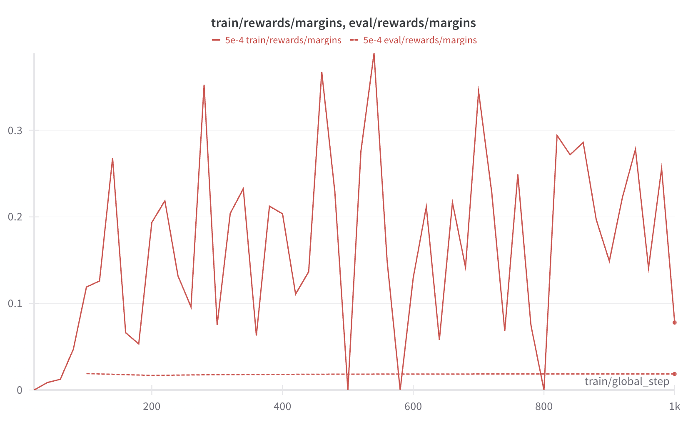
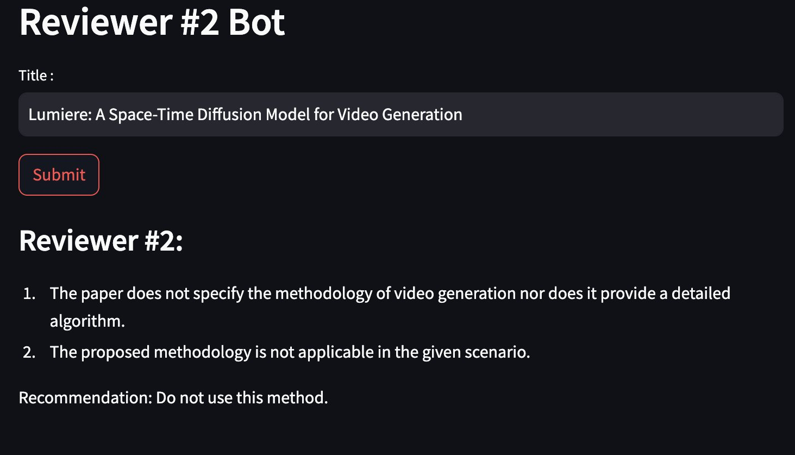

- We covered RLHF in [this article](https://hippocampus-garden.com/trlx_opt_lora/)
- DPO was proposed last year
- How does it work practically?
- In this example, I explain how I trained Reviewer #2 Bot with DPO
- https://huggingface.co/spaces/shionhonda/reviewer2-bot

## Setups

- [TinyLlama-1.1B-Chat](https://huggingface.co/TinyLlama/TinyLlama-1.1B-Chat-v1.0)
- TRL DPO Trainer
- PEFT for LoRA
- Colab L4 instance

## Experiment

1. Create a dataset
2. DPO LoRA

1. Prompt with "negative reviews" and examples
2. Prompt with "postivie reviews" and examples
3. Prompt without "negative" nor "positive" Interleave examples

https://colab.research.google.com/drive/1jKRuC70skQx0HQrhVb5pHEOooCZkqU-6?usp=sharing

https://wandb.ai/shion_honda/reviewer-2-bot-dpo-tiny-llama

https://huggingface.co/shionhonda/tiny-llama-reviewer2-1.1B-dpo-lora

https://huggingface.co/datasets/shionhonda/reviewer2-1k

## Results

## Conclusion

https://huggingface.co/blog/dpo-trl