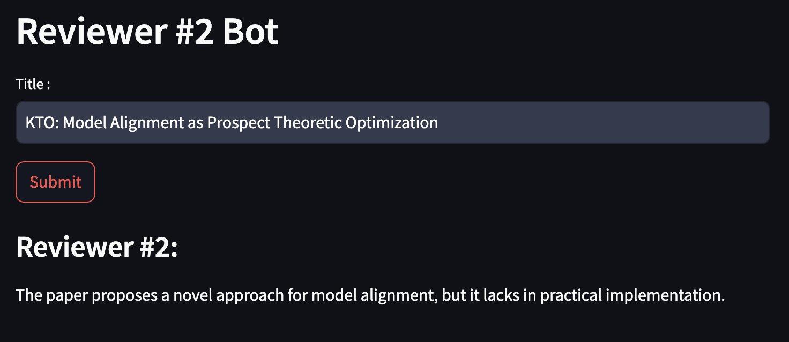

In [the previous post](https://hippocampus-garden.com/tiny_llama_dpo_lora/), I demonstrated how to align large language models (LLMs) without the need for complex reinforcement learning, using [**direct preference optimization** (**DPO**)](https://arxiv.org/abs/2305.18290). Since DPO was proposed, many improvements have been made, and one of them is [**Kahneman-Tversky optimization** (**KTO**)](https://arxiv.org/abs/2402.01306). This innovative method simplifies the alignment process even further by utilizing unpaired binary labels —gathered simply through thumbs-up or thumbs-down responses— instead of the more cumbersome pairwise preferences.[^1] This change significantly eases the data collection process, making it faster to align LLMs effectively. Today, I'll show you how to use KTO to create the [Reviewer #2 Bot](https://huggingface.co/spaces/shionhonda/reviewer2-bot) from TinyLlama, just like I did with DPO in the previous post.

Similarly to the post about DPO, all the artifacts of this project are publicly accessible:

- [Dataset shionhonda/reviewer2-1k-unpaired](https://huggingface.co/datasets/shionhonda/reviewer2-2k-unpaired)
- [Model shionhonda/tiny-llama-reviewer2-1.1B-dpo-lora](https://huggingface.co/shionhonda/tiny-llama-reviewer2-1.1B-dpo-lora)
- [Training script](https://colab.research.google.com/drive/1jKRuC70skQx0HQrhVb5pHEOooCZkqU-6?usp=sharing)
- [Training log](https://wandb.ai/shion_honda/reviewer-2-bot-dpo-tiny-llama)

Also, if you are interested in the theory behind KTO, I recommend reading the [original paper](https://arxiv.org/abs/2402.01306). In short, KTO uses a loss function representing the value relative to a reference point, which is inspired by the [prospect theory](https://en.wikipedia.org/wiki/Prospect_theory) of Daniel Kahneman and Amos Tversky. As an additional benefit, KTO can align LLMs without applying **supervised fine-tuning** (**SFT**) when they are sufficiently good.

## Setup

In this experiment, I used the following resources:

- Hardware: Colab L4 instance (22.5GB VRAM)
- Pretrained model: [TinyLlama-1.1B-Chat](https://huggingface.co/TinyLlama/TinyLlama-1.1B-Chat-v1.0)
- Dataset: [shionhonda/reviewer2-2k-unpaired](https://huggingface.co/datasets/shionhonda/reviewer2-2k-unpaired)
- KTO trainer: [TRL](https://huggingface.co/docs/trl/en/index) v0.8.5
- LoRA: [PEFT](https://huggingface.co/docs/peft/en/index) v0.10.0

## Dataset

As I mentioned earlier, KTO doesn't require pairwise preferences. The [KTO trainer works with a standard dataset](https://huggingface.co/docs/trl/main/en/kto_trainer#expected-dataset-format) that contains 3 columns:

- prompt: input text
- completion: output text
- label: boolean value representing if the completion is preferred or not

I created a dataset of this format ([reviewer2-2k-unpaired](https://huggingface.co/datasets/shionhonda/reviewer2-2k-unpaired)) by unpairing the dataset for DPO ([reviewer2-1k-paired](https://huggingface.co/datasets/shionhonda/reviewer2-1k-paired)). See the [previous post](https://hippocampus-garden.com/tiny_llama_dpo_lora/) for details about how I created the paired dataset.

## KTO Training

Next, I ran the KTO trainer with the following configuration:

```python
class Config:
    beta = 0.1 # the beta parameter for KTO loss
    learning_rate = 5e-4
    lr_scheduler_type = "cosine"
    optimizer_type = "paged_adamw_32bit"
    batch_size = 16
    lora_alpha = 16
    lora_dropout =0.05
    lora_r = 8
    max_prompt_length = 256
    max_length = 128
    max_steps = 2000
```

The entire script is [here](https://colab.research.google.com/drive/1jKRuC70skQx0HQrhVb5pHEOooCZkqU-6?usp=sharing) and the training logs are [here](https://wandb.ai/shion_honda/reviewer-2-bot-kto-tiny-llama).

## Results

Here are the learning curves:


They look good as the validation loss is decreasing and the reward is increasing steadily. This is notably different from the DPO training in my previous post, where the they were fluctuating.

The KTO-trained model looks better than the DPO-trained model qualitatively as well. You can see it by chatting with the bot [here](https://huggingface.co/spaces/shionhonda/reviewer2-bot). For busy readers, I share a sample output here:



I speculate that KTO worked better than DPO because KTO is more robust to the noisy labels than DPO. According to the [original paper](https://arxiv.org/abs/2402.01306):

> our theoretical analysis suggests that if your preference data has sufficiently little noise and sufficiently little intransitivity, then DPO will work better, since there is some risk of KTO underfitting. But if there is enough noise and transitivity, then the better worst-case guarantees of KTO will win out.

In our setting, some of the data (but not their labels) are supposed to be noisy because [I faked the prompts when creating the dataset](https://hippocampus-garden.com/tiny_llama_dpo_lora/#preference-dataset). KTO is better at ignoring the noise than DPO, which can explain why KTO worked better in this case.

## Conclusion

In this article, I showed how to align LLMs without paired preference data using KTO. As paired preference data is harder to collect than unpaired data, I believe that we will see more and more use cases of KTO in the near future. I hope this article helps you create your own KTO-trained LLMs!

[^1]: Typically, you need to show two variations of outputs to the user and ask them which one they prefer.
