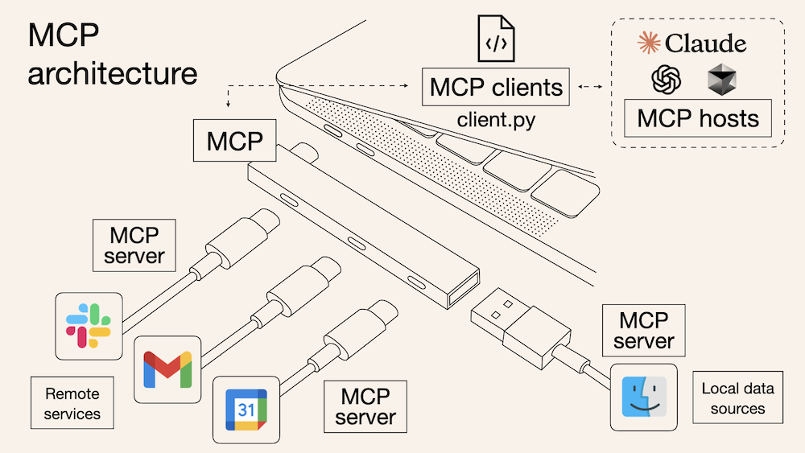

I often hear questions like "What are skills compared to tool calling?" or "Why do coding agents prefer CLI over MCP?" These questions are useful, but they often mix together different layers of the stack.

Let's see how they work at the low level.

## Everything Reduces to Context

At the lowest level, an LLM predicts the next token. An LLM does not directly execute tools or run a skill. It generates tokens under a context assembled by the runtime. Tool schemas, MCP-provided tools, and skill documents all matter because they change that context.[^1]

From that point of view, the difference between tool calling, MCP, and skills is not that one is "inside" the model and another is not. The difference is what kind of information gets injected into the prompt, and what the runtime does after the model responds.

- **Tool calling** gives the model a structured output format.
- **MCP** gives _the application_ a standard way to fetch and expose tools.
- **Skills** give the model procedural guidance in natural language.

## Tool Calling

Tool calling is the lowest layer. The application gives the model a tool schema, and the model emits a structured request such as:

```json
{
  "name": "get_weather",
  "arguments": {
    "location": "Rome"
  }
}
```

The model is not executing `get_weather`. It is generating tokens that look like a function call. The runtime parses that output, runs the actual function, and sends the result back. That is why tool calling is best understood as a **syntax layer**: it constrains how the model asks for an action, but execution still happens outside the model.

## MCP

**MCP** (**Model Context Protocol**) sits above tool calling. It standardizes how a host application can connect to external servers that provide tools, resources, and prompts.[^2]

From the model's point of view, however, the core loop is still familiar: it sees tool names, descriptions, and schemas, then emits a structured request. What MCP changes is how those tools are supplied. Instead of hardcoding every tool inside one application, the host can obtain them from external servers.

If you want a more introductory explanation of MCP itself, I wrote one [here](https://hippocampus-garden.com/claude_mcp/).



<div style="text-align: center;"><small>MCP is often described as a USB-C port for AI agents because it standardizes how tools are connected.</small></div>

<br/>

So MCP is not a replacement for tool calling. It is closer to a **transport layer** for supplying tools to the runtime.

## Skills and Dynamic Loading

Skills are different again. A skill is usually a text file such as `SKILL.md` that tells the model how to approach a class of tasks. It is not normally executed like a tool. It is read like instructions.

Here is a more realistic example:

```md
---
name: weather-brief
description: Answer weather questions by calling `get_weather`, then summarize the result clearly.
---

# Weather Brief

When the user asks about weather:

1. Extract the location from the request.
2. Call `get_weather`.
3. Summarize temperature, condition, and any warning.
4. If the location is ambiguous, ask a short follow-up question.

If needed, read `references/units.md` before answering.
```

A typical skill directory can also include supporting files:

```text
skills/
  weather-brief/
    SKILL.md
    references/
      units.md
      style_examples.md
    scripts/
      normalize_location.py
```

This is why a skill is better understood as a **reasoning scaffold**. It does not do the work itself. It biases the model toward a particular plan, order of operations, or style of answer. It also helps with two scaling problems that appear when agents become more capable: **context flooding** and **tool discovery**. Instead of dumping every possible workflow into the prompt, the runtime can load skills dynamically. Public documentation suggests a progressive pattern: first inspect lightweight metadata in the frontmatter, then read the relevant `SKILL.md`, and only later consult supporting files such as references or scripts if needed.[^3] That keeps the prompt smaller and makes routing easier.

The exact selection logic is not public, but it is probably a hybrid: a rule-based or metadata-based filter first (for maxmizing recall), then a more accurate LLM-based decision on the narrowed candidate set (for maximizing precision).[^3][^4][^5]

## Why CLI Became So Common

One visible trend in coding agents is that CLI is becoming more common. Claude Code, Codex, Cursor, and similar systems often rely heavily on shell access even when more structured interfaces are available.

There are a few reasons for this. First, many developer tools already expose a CLI (e.g., `git`, `docker`, `terraform`), so an agent can use existing interfaces instead of waiting for someone to build and maintain an MCP server. Second, recent models became much better at writing commands, reading `stdout` and `stderr`, and retrying after failure. Third, CLI has simple feedback signals such as exit codes and error messages, which makes the loop easier to debug. That does not mean CLI is always better than MCP, but it does explain why it became common so quickly.[^6]

## Conclusion

Tool calling, MCP, and skills are not interchangeable. They solve different problems.

- Tool calling is the syntax for requesting an action.
- MCP is the transport for supplying tools dynamically.
- Skills are prompt-level guidance for how to think.

Once you separate those layers, recent agent design trends become easier to understand. Skills did not make MCP obsolete. CLI did not make structure irrelevant. What changed is that better models made it more practical to shift some complexity from rigid interfaces to prompt construction and runtime orchestration.

[^1]: [How LLMs Actually Process Your Prompts, Tools, and Schemas](https://hippocampus-garden.com/llm_serialization/).
[^2]: [Model Context Protocol introduction](https://modelcontextprotocol.io/introduction).
[^3]: Anthropic, [Claude Code slash commands](https://docs.anthropic.com/en/docs/claude-code/slash-commands).
[^4]: OpenAI, [Codex Skills](https://developers.openai.com/codex/skills/) and [Testing Agent Skills Systematically with Evals](https://developers.openai.com/blog/eval-skills/).
[^5]: Sarat Mudunuri, Jian Wan, Ally Qin, Srinivasan Manoharan. [Semantic Tool Discovery for Large Language Models: A Vector-Based Approach to MCP Tool Selection](https://arxiv.org/abs/2603.20313).
[^6]: Adrian Machado, [CLI vs MCP: Which Interface Works Best for AI Agents?](https://zuplo.com/blog/cli-or-mcp).
