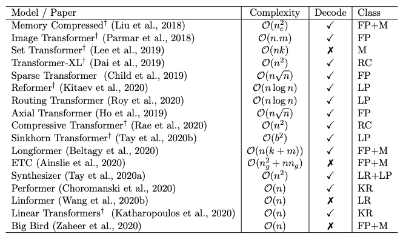
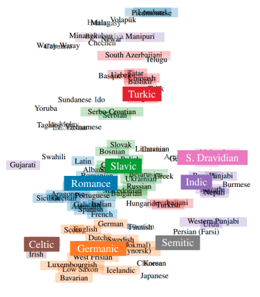

## Efficiency & Long-term Context
There are plenty of efficient Transformers, often named in the form of X-former: Reformer, Linformer, Performer, ... just to name a few. Recently, a team from Google published an excellent survey on this topic [1]. Here is the representative figure and table.

<small>Images from [1]. It is not clear from the paper whether the "Complexity" column of the table refers to computational or memory complexity.</small>

They propose the following taxonomy for X-formers: 

- **Fixed Patterns**: This earliest approaches sparsify the attention matrix by limiting the number of token pairs with pre-defined patterns such as blocks and strides.
- **Combination of Patterns**: This simply combines two or more of the fixed patterns to improve the coverage.
- **Learnable Patterns**: The patterns are parametrized and learned through training just as other weights.
- **Memory**: The core idea of this approach is to create some "global tokens" that can access multiple tokens at once. These tokens are supposed to serve as a memory module.
- **Low Rank**: Low-rank methods reduce the length dimensions of keys and values to $k~(<n)$, which results in the complexity reduction from $\mathcal{O}(n^2d)$ to $\mathcal{O}(nkd)$.
- **Kernel**: This utilizes kernelization to approximate the attention matrix with smaller complexity.
- **Recurrence**: Blockwise attentions are connected with reccurent mechanism.

Let's take a closer look at individual models.

### Sparse Transformer [Child+, 2019]
[**Sparse Transformer** [Child+, 2019]](https://arxiv.org/abs/1904.10509) sparsifies the attention matrix by adopting local attention (lightblue) and strided attention (lightgreen), as described in the figure below.

<small>Images from [1].</small>

This modification reduces the memory complexity of the attention
layer from $\mathcal{O}(n^2)$ to $\mathcal{O}(n\log{n})$. However, it requires a custom GPU kernels to implement a block-sparse *matmul* (i.e., matrix-matrix multiplication) operation.

The paper by a team from OpenAI presents impressive results. The autoregressive generative model generates texts, 64x64-sized images, and even raw audio waveforms (you can listen to them in [the official blog post](https://openai.com/blog/sparse-transformer/)). Sparse Transformer is important because subsequent models such as [**Longformer**](https://arxiv.org/abs/2004.05150) and [**Big Bird**](https://arxiv.org/abs/2007.14062) are based on it.

Sparse Transformer is inherited to another research work called [Jukebox](https://arxiv.org/abs/2005.00341), which successfully generates music waveforms in a variety of genres. Jukebox can generate minutes-length music conditioned by genres, lyrics, and artists (from Ella Fitzgerald to Kanye West). All 7,131 generated samples are available [here](https://jukebox.openai.com/). They do make sense!

### Routing Transformer [Roy+, 2020]
[**Routing Transformer** [Roy+, 2020]](https://arxiv.org/abs/2003.05997) uses learnable patterns to sparsify the attention matrix. It clusters the input tokens with **k-means** algorithm in an online fashion so that each token only attend to the tokens beloging to the same cluster.

### Reformer [Kitaev+, 2020]
[**Reformer** [Kitaev+, 2020]](https://arxiv.org/abs/2001.04451) uses **locality sensitive hashing (LSH)** to learn attention patterns.

### Linformer
### Performer
### Transformer-XL
### Long Range Arena: Benchmarking X-formers

Performance (y axis), speed (x axis),
and memory footprint (size of the circles) of different models.

## Image
### Image Transformer
### Training on Pixels
### ViT
### Video

[(Self-attention Network)](https://arxiv.org/abs/2004.13621)

## Theory of Computation

## Pre-trained Language Models & BERTology
Out of scope, but uses transformer or similar attention-based architecture.
### XLNet
### mT5
### SOTA

<small>Image from [How Language-Neutral is Multilingual BERT?](https://arxiv.org/abs/1911.03310).</small>

## References
[1] Yi Tay, Mostafa Dehghani, Dara Bahri, Donald Metzler. "[Efficient Transformers: A Survey](https://arxiv.org/abs/2009.06732)". 2020.

[A Survey of Long-Term Context in Transformers](https://www.pragmatic.ml/a-survey-of-methods-for-incorporating-long-term-context/) Another (older) survey of Efficient Transformers

[Long range arena](https://openreview.net/forum?id=qVyeW-grC2k) Nice figure

[The Transformer Family](https://lilianweng.github.io/lil-log/2020/04/07/the-transformer-family.html) Lil'log

[A Primer in BERTology: What we know about how BERT works](https://arxiv.org/abs/2002.12327)

## Appendix
Layer normalization

https://paperswithcode.com/method/layer-normalization