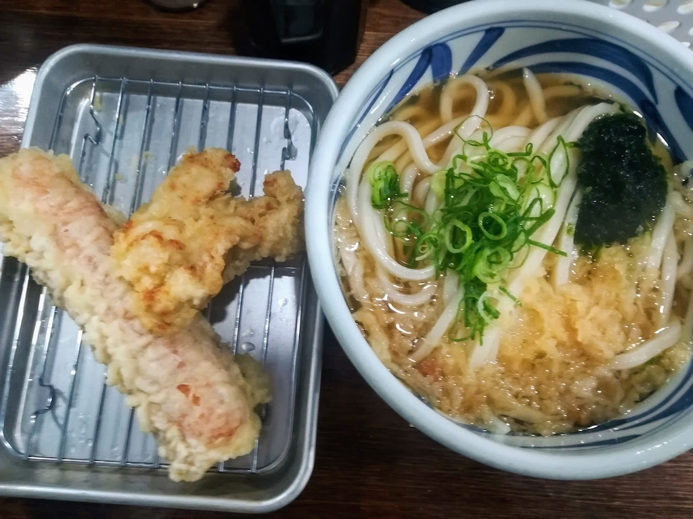
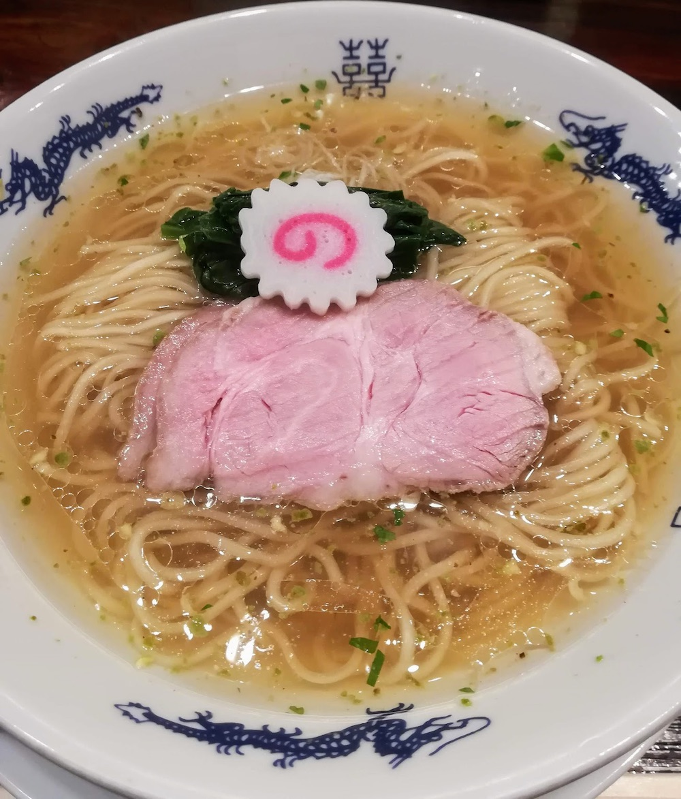
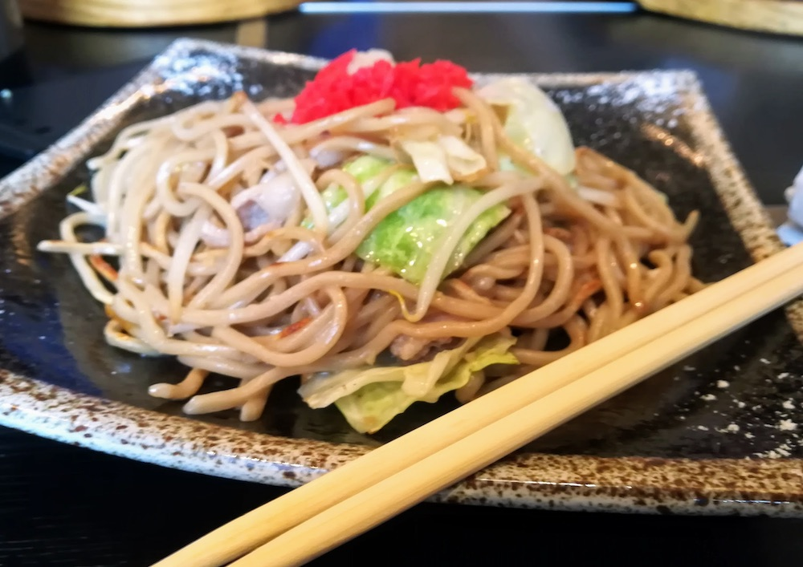
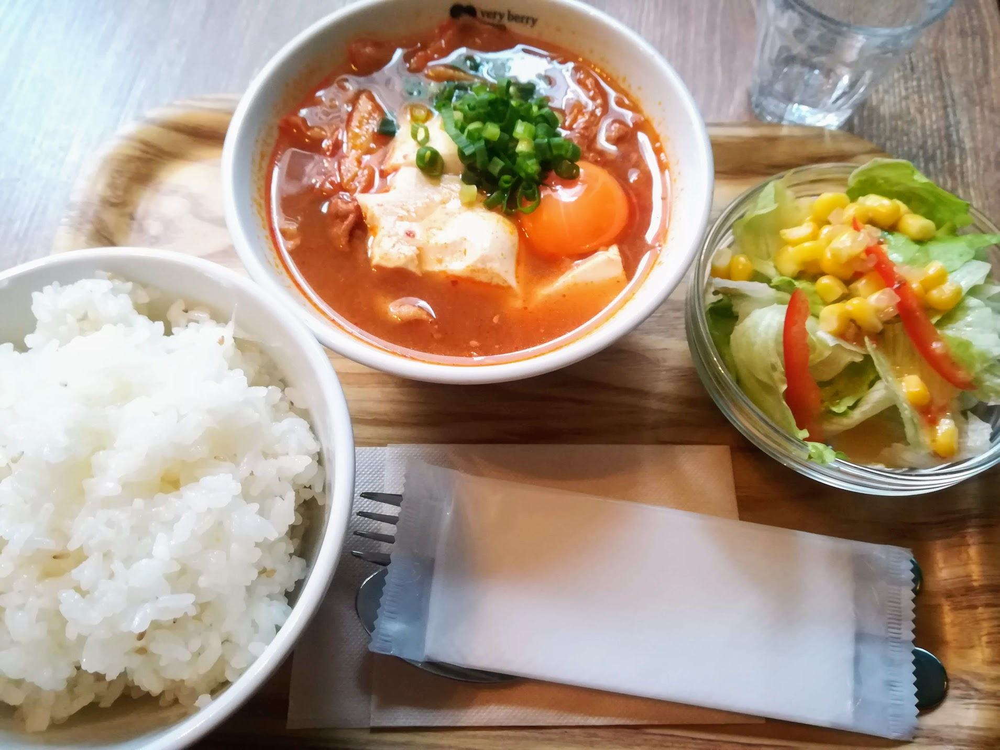

今月いっぱいで4年ほど通った本郷から離れるので、ランチでの利用を想定して、個人的に気に入った飲食店をまとめてみたいと思います。

本郷は、東大のもう一つのメインキャンパスがある駒場よりも賑やかな街で、食べるところの選択肢もずっと多いです。先日はテレビ東京の『[出没！アド街ック天国](https://www.tv-tokyo.co.jp/adomachi/backnumber/20200307/)』で本郷が特集され、いくつかの有名店が紹介されていました。本郷は歴史のある街で、東大のキャンパス以外にも見どころが多いので、訪れる方の参考になれば幸いです。

グルメマップはこちらです。
<iframe src="https://www.google.com/maps/d/u/0/embed?mid=1ePzELkCDlWLGRKNQ8PMeHqMV29h27yT_" width="640" height="480"></iframe>

私は辛いものが好きでよく食べるのですが、苦手な方も多いと思うので、マップは辛いものとそれ以外で分けています。今回は前編ということで、辛いもの以外の21軒を紹介します（順不同）。

<small>
おことわり
<ul>
<li>本記事の内容は個人の感想を含みます。内容について一切の責任を負いません。
<li>定休日やメニュー、値段などの最新・詳細の情報はお店の公式サイトなどをご覧ください。
<li>店名表記はGoogleマップを参考にしました。
<li>有名チェーン店はリストから外しています。
</ul> 
</small>

## 麺屋 ねむ瑠
「**ねむ瑠**」は、春日通り沿いにある、「イカと煮干し」と「赤鶏とハマグリ」という珍しい出汁を使ったラーメンが人気の店です。油そばのようにそのまま食べられる具入りの替え玉も美味しいです。ピーク時には行列ができます。写真は赤鶏とハマグリの塩味です。

## ファイヤーハウス
「**ファイヤーハウス**」は、春日通り沿い、本郷三丁目駅と後楽園駅の中間くらいにあるハンバーガー店です。レトロな外装と内装のお店で、本格ハンバーガーを味わうことができます。ピーク時には行列ができます。

何度も行っているのですが、自分の写真フォルダを探してもサンドイッチの写真しか見つかりませんでした……

## トウキョウライトブルー ホンゴウスリー
「**トウキョウライトブルー ホンゴウスリー**」は、本郷通り沿い、本郷三丁目駅から出てすぐのところにある立ち食いうどん店です。ボリュームのあるうどんと日替わりのユニークな天ぷらが美味しいです。元々は五反田の「おにやんま」から暖簾分けした「こくわがた」というお店だったのですが、最近リニューアルしました。ピーク時には行列ができます。

こちらは「きまぐれL.B.うどん」です。

こちらは「かけうどん」です。

## 味噌煮込罠
「**味噌煮込罠**」は本郷通りから一本入ったところにある味噌煮込みうどんのお店です。熱々の味噌煮込みうどんは寒い日には極上です。「イタリアン味噌煮込みうどん」のような変わり種メニューもあります。ピーク時には行列ができます。

## 中華蕎麦 にし乃
「**中華蕎麦 にし乃**」も本郷通りから少し入ったところにあります。こだわりを感じる澄んだスープの中華そばで、トッピングにはワンタンをつけることができます。ミシュランのビブグルマンに選ばれているそうで、こちらも行列店です。店主が乃木坂46のファンらしく、店名は西野七瀬にちなんで付けられたとか。

## 本郷三丁目 aglio385（アーリオ ミヤゴ）
「**aglio385**」は、春日通りから一本入ったところにあるにんにく料理のお店です。ランチはオムライスなどの日替わりメニューがあります。写真は撮り忘れました。

## 焼きそばのまるしょう 本郷三丁目店
「**焼きそばのまるしょう**」は、春日通り沿いにある焼きそば専門店です。定番のソースや塩だけでなく、カレーやイカスミといった変わり種の焼きそばを食べることができる珍しいお店です。

## Da Mau
「**Da Mau**」は、菊坂通り沿いにあるイタリアンです。日替わりのパスタ、ピザ、リゾットがいつも美味しいです。

## Lento レント
「**Lento**」は、菊坂通り沿いにある小さなワインバルです。Da Mauの向かいにあります。こちらのお店はランチタイムにパスタやキッシュなどのおしゃれなメニューを出しています。

## 肉丼専門店 本郷肉劇場
「**本郷肉劇場**」は、本郷通り沿いに昨年くらいにできた肉丼チェーンの本郷店です。豚ロースや牛カルビなど、様々な肉の種類から選んで丼を注文することができます。最近リニューアルしたようです。

## ラ・ストラーダ・ディ・カンパーニャ
「**ラ・ストラーダ・ディ・カンパーニャ**」は、本郷通り沿いにあるイタリアンで、トスカーナ地方の料理を食べることができます。日替わりを含むパスタメニューやラザニアがあります。

こちらは「ラザニア」です。

こちらは「牡蠣と柿（！）を使ったタリアテッレ」です。

## 家家家 本郷店
「**家家家**」は、本郷通り沿いにあるラーメン店です。店名の通り、家系です。写真は撮り忘れました。

## Social Cafe Sign with Me 本郷店
「**Sign with Me**」は、本郷通り沿いにあるスープカフェで、スープやパスタを食べることができます。公用語は日本手話と書記日本語（筆談）だそうで、注文はメニューの指差しで行うことができます。辛いもの以外と言いつつ、スンドゥブを注文してしまいました。

## 海鮮どんぶり銀はち東大赤門店
「**海鮮どんぶり銀はち**」は赤門の目の前にある海鮮丼店です。海鮮丼はもちろん、あおさの味噌汁も美味しいです。

## もり川
「**もり川**」は、赤門と正門の中間くらいにある東大生御用達の定食屋です。看板には「東大生と共に明治から」とあり、歴史を感じさせます。

美味しいので何度も訪問しているのですが、写真を撮り忘れてしまいました。

## 吉田とん汁店
「**吉田とん汁店**」は、正門の目の前にある豚汁専門店です。豚汁は具だくさんで丼いっぱいに入っているので、これだけでも満足感があります。

## 石垣の塩まぜそば 織恩
「**織恩**」は、東大前駅近くにある混ぜそば店です。石垣の塩や青のりを使った沖縄風の珍しい混ぜそばを食べられます。

一度閉店してしまったのですが、昨年新しい店主が引き継ぎ、クラウドファンディングを経て復活を遂げました。詳しい経緯は[こちら](https://camp-fire.jp/projects/view/178346)。

## 用心棒 本号
「**用心棒**」は、東大前近くにあるラーメン店です。こちらは写真の通り二郎インスパイア系のお店です。ピーク時には行列ができます。最近、年齢のせいかこの量を食べるのが難しくなってきました……。

夏季限定の「冷やし中華」もあります。

## ごち屋 本郷店
「**ごち屋**」は、本郷通り沿いにある鉄板焼き店です。ランチタイムは定食メニューを出していて、写真は個人的に好きな「目鯛と茄子の揚げ出し」です。

## IZASA
「**IZASA**」は、本郷通り沿いにあるつけ麺・ラーメン店です。筍や大葉を使ったおしゃれなつけ麺とラーメンが食べられます。写真は撮り忘れました。

## 炭火焼肉 牡丹苑
「**牡丹苑**」は、にし乃の近くにある焼肉店です。ランチでも米沢牛を食べることができます。

こちらは、記憶が正しければ、10食限定の「日替わりランチ（牡丹丼）」です。

こちらは石焼ラーメンです。

