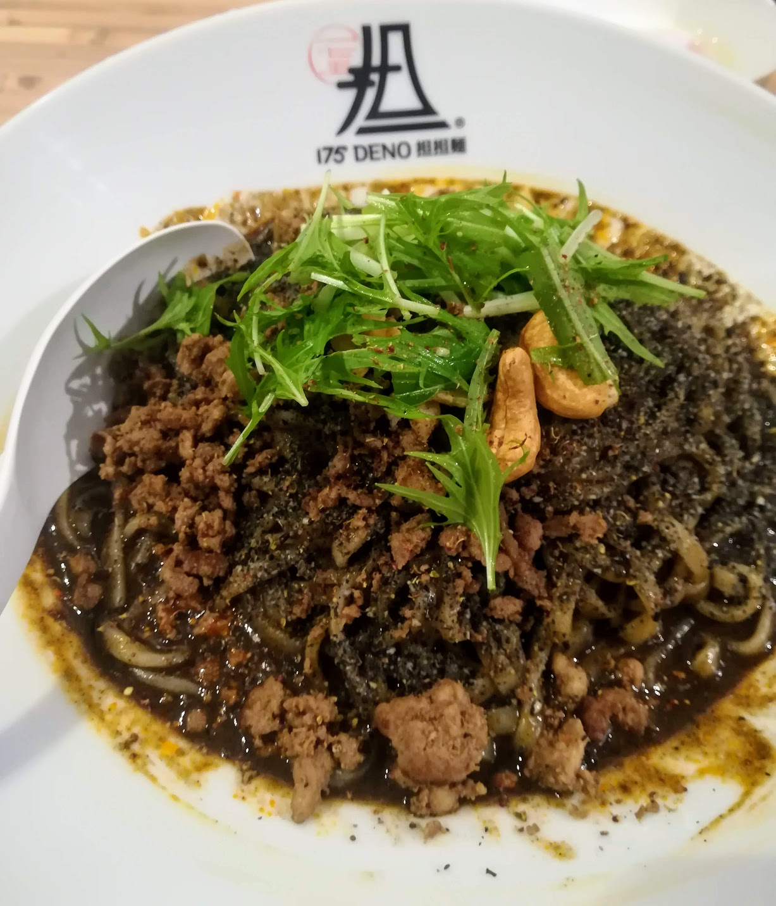
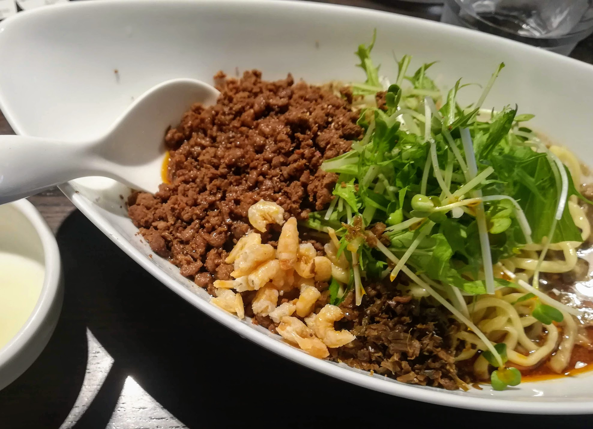
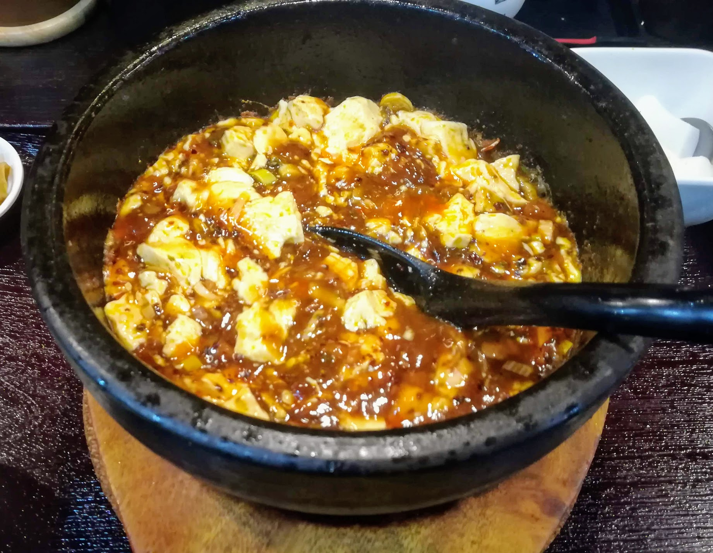
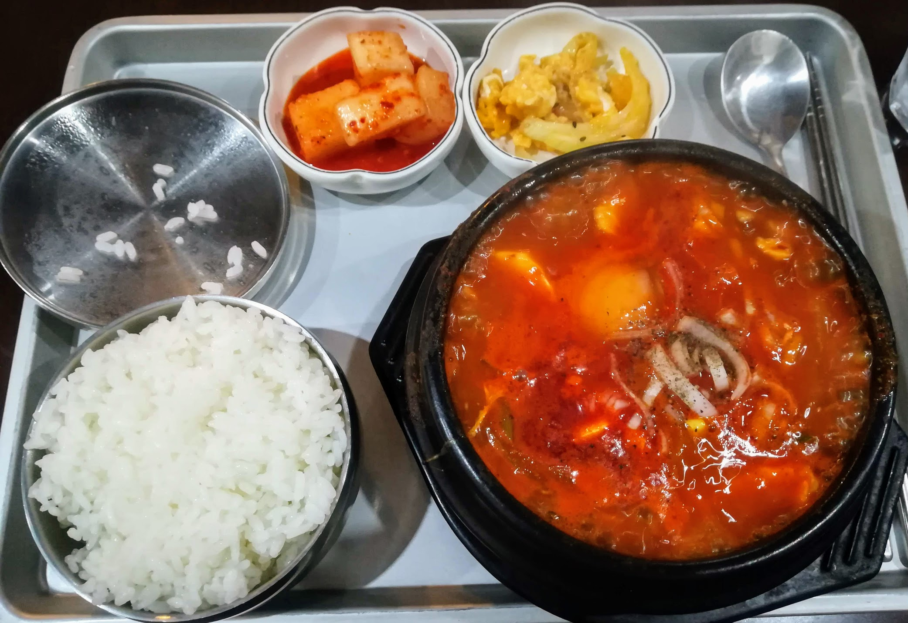
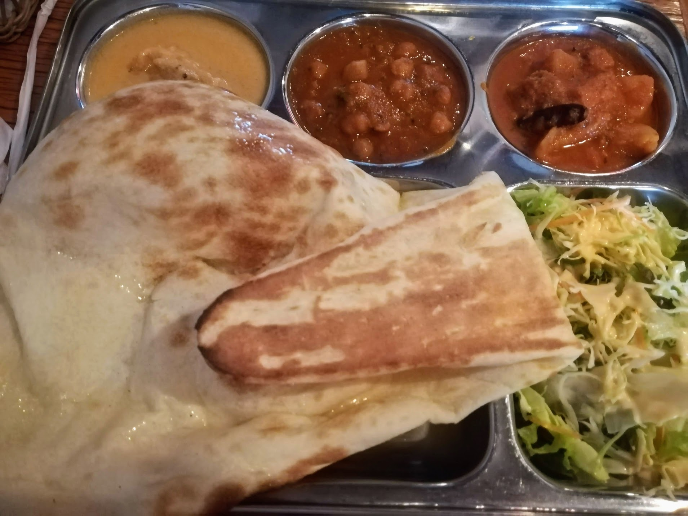
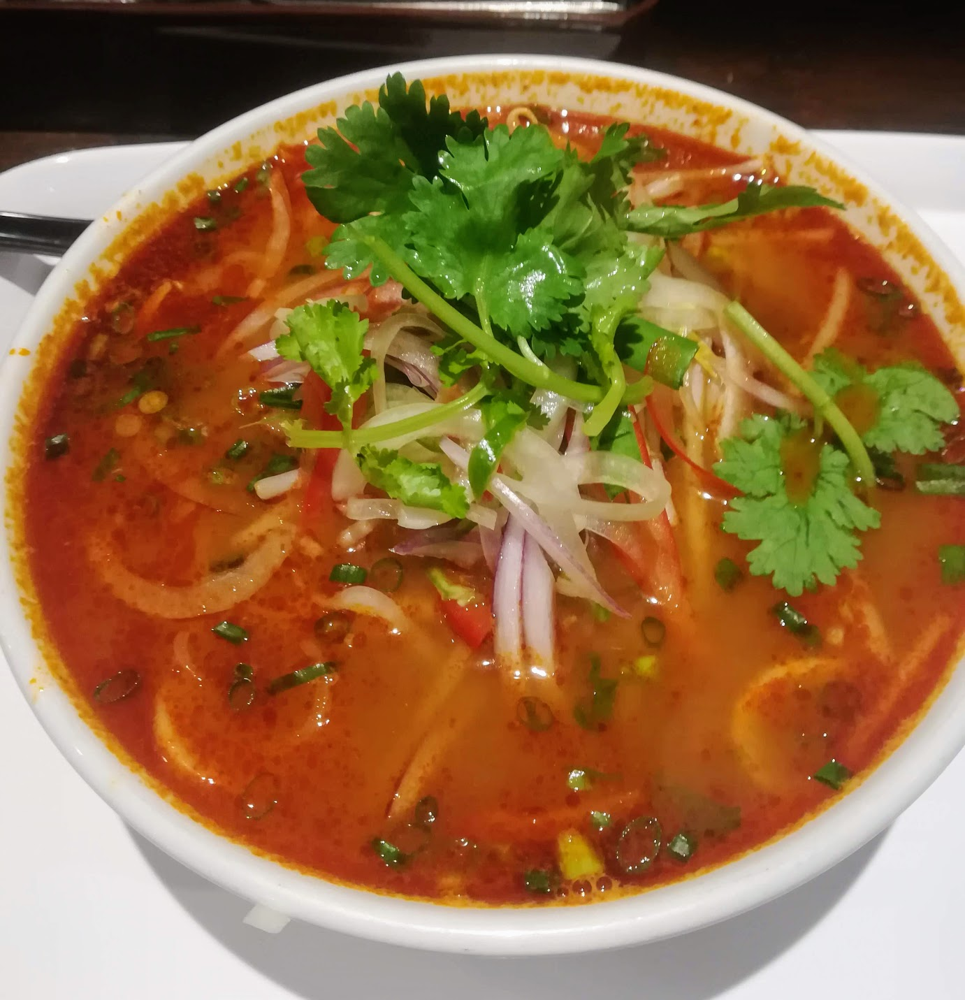
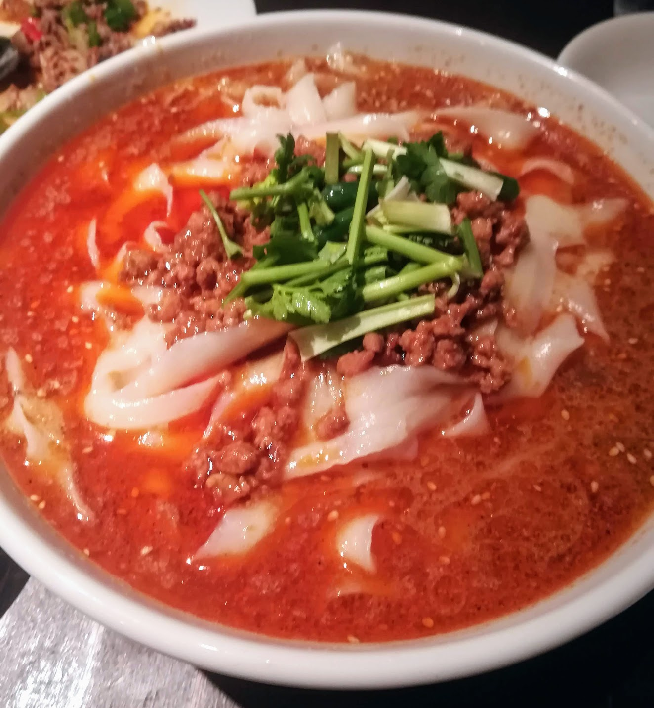

辛いもの好きの方、お待たせしました。[前回](https://hippocampus-garden.com/hongo_groumet/)紹介したグルメマップの続きです。
<iframe src="https://www.google.com/maps/d/u/0/embed?mid=1ePzELkCDlWLGRKNQ8PMeHqMV29h27yT_" width="640" height="480"></iframe>

本郷にはインド料理や中華料理のお店が多いので、辛いもの好きとしてはありがたく利用していました。
今回は、担々麺やカレーなど、辛いものをメインで出しているお店16軒を紹介します（順不同）。

<small>
おことわり
<ul>
<li>本記事の内容は個人の感想を含みます。内容について一切の責任を負いません。
<li>定休日やメニュー、値段などの最新・詳細の情報はお店の公式サイトなどをご覧ください。
<li>店名表記はGoogleマップを参考にしました。
<li>有名チェーン店はリストから外しています。
</ul> 
</small>

## 175°DENO担担麺 本郷三丁目店
「**175°DENO**」は北海道発の担々麺のチェーンで、本郷通り沿い、本郷三丁目駅から出てすぐのところにあります。辛さ・痺れの度合いを選ぶことができます。カシューナッツが乗っているのが特徴です。

二郎系担々麺もあります。

## 阿吽 湯島本店
少し本郷から離れてしまいますが、湯島駅近くにある「**阿吽**」は担々麺の有名なお店です。こちらも辛さ・痺れの度合いを選ぶことができます。ピーク時には行列ができます。

汁ありだとひき肉などの細かい具がスープの中に沈んでしまうので、私は汁なし派です。

## 蓬渓閣
「**蓬渓閣**」は、本郷通り沿いにある四川料理店です。私は四川に行ったことはありませんが、本場の味に近いのか、お店は中国人学生らしきお客さんで混雑しています。

看板メニューの「地獄の石焼麻婆豆腐」は衝撃的な辛さでした。初めて食べたときに3段階のうち2番目の辛さを選んだところ、料理が運ばれてきた瞬間、カプサイシンを含んだ蒸気で息ができなくなってしまったほどです。初めて挑戦される方は1辛から始めることをおすすめします笑

こちらは「担々刀削麺」です。大盛りはかなりのボリュームです。

激辛好きにおすすめのお店ですが、海鮮チャーハンなど辛くないメニューもあります。

## グリーンアップル
「**グリーンアップル**」は、本郷通り沿いを一本入ったところにあるバーです。ランチで食べられるチーズキーマカレーが美味しいです。写真は撮り忘れました。

## 本格韓国家庭料理 いなか家
「**いなか家**」は、本郷通り沿いを一本入ったところにある、本郷には珍しい韓国料理店です。スンドゥブチゲなど韓国の家庭料理が食べられます。店内は外から見るより広いので、満員に見えても諦めないでください。

## からみちゃん
「**からみちゃん**」は、本郷通り沿いにあるカレー店です。このお店がすごいのは、タイ風、インド風、欧風という全く異なる種類のカレーを常に出しているところです。私は挑戦したことがありませんが、「カリーパスタ」というメニューもあります。

## フランスカレー
「**フランスカレー**」は、東大前駅近くにあるカレー店です。フランス風なのかはわかりませんが、ナッツやフルーツの入った創作系カレーが楽しめます。写真がないと何も説明できていないと思いますが、残念ながら写真を撮り忘れてしまいました。

## ダージリン 本郷店
「**ダージリン**」は、赤門近くにあるインド料理店です。日替わりのカレーが複数種類ついたセットを食べることができます。本郷三丁目駅や春日駅近くにも系列店がある人気店です。

## Baan Khun Mae
「**Baan Khun Mae**」は赤門近くにあるタイ料理店です。タイ料理も本郷周辺では珍しいと思います。

## 瀬佐味亭
「**瀬佐味亭**」は、赤門近くにある担々麺屋です。名前の通り胡麻の香りの高いスープが魅力なのですが、ゆずの皮を入れたりと細部に様々なこだわりを感じる味です。

先輩に教えてもらったのですが、瀬佐味亭は[レシピを公開しています](http://home.f00.itscom.net/sesami/)。OST (open source tantanmen)というわけですね。クローンするのはそう簡単にはいかなさそうですが笑

## 麻辣湯
「**麻辣湯**」は、最近春日通り沿いにできた麻辣スープ春雨のお店です。店名がこれで合っているのかよくわかりません。

辛さ、麺の量、具を選んで作ってもらうという方式のお店で、たくさんのスパイスを使った麻辣湯を食べられます。春雨なのでヘルシーです。

## 浜そば
「**浜そば**」は、湯島駅近くにある油そば店です。辛くて満足感のある油そばです。お店が小さめなので並ぶことが多いです。

## 中華ビストロ龍藏
「**龍蔵**」は、赤門近くにある中華料理店です。ビルの中にあるので見つけづらいかもしれません。担々麺の見た目がこの通り、美しいです。もちろん、ジャージャー麺など他のメニューもあります。写真は撮り忘れました。

## 西安刀削麺酒楼 本郷店
「**西安刀削麺酒楼**」は、本郷三丁目駅近くにある西安料理店です。落ち着いた雰囲気のお店で刀削麺などが食べられます。

## 湯島ひよこ堂
「**ひよこ堂**」は、湯島天神近くにある広島式汁なし担々麺専門店です。汁なし担々麺は元々広島で生まれたそうですね。写真は撮り忘れました。

## サモサ
「**サモサ**」は菊坂通りの入口近くにあるインド料理店です。カレーはもちろん、「アジアンダイニング」なので春巻きやナシゴレンもあります。ランチドリンクでビールが頼めてしまいます。

## お口直し（廚菓子くろぎ）
担々麺とカレーばかり紹介してしまったので、お口直しの代わりにお菓子・スイーツについても少しだけ書こうと思います。

本郷には老舗の和菓子店が点在しています。ここでは名前を挙げることはしませんが、それぞれ特色があるので食べ比べてみるのもおもしろいかもしれません。

また、最近のタピオカブームは本郷にも確実にも届いており、把握しているだけでも5店舗以上はあります。老舗の和菓子店と今どきのタピオカスタンドが共存しているのはなかなか素敵ですね。

最後に、甘いものが好きな方は、本郷キャンパス内・春日門近くにある和菓子店「**くろぎ**」に行くと幸せになれるかもしれません。このお店はカフェを併設していて、隈研吾建築のダイワユビキタス学術研究館のテラス席で名物のかき氷などを食べることができます。

値段が高め、かつ大人気なので気軽には行けないのですが、行ってみる価値はあると思います。