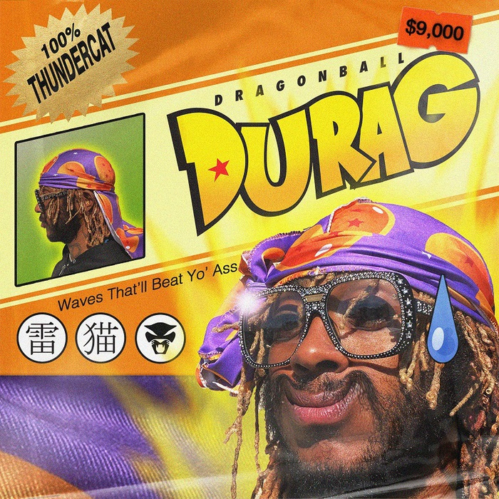

今月のプレイリストはこちらです。

https://open.spotify.com/playlist/13m9wVRLT70lAP3ygNmhKd?si=YWbOo5QgR-WSrIeJj6Qd7Q

以下、何曲かピックアップします。

## 新作
2曲目は、Perfume Geniusの新譜『Set My Heart On Fire Immediately』から、Lady GagaがAriana Grandeとコラボした3曲目は新譜『Chromatica』からです。  
Yumi Zoumaの『Lonely After』は、The Japanese Houseを思わせるような爽やかなインディーサウンドが梅雨を晴らしてくれそうです。  
漫画『ドラゴンボール』が好きで前作でも歌詞に登場させていたThundercatですが、今度はタイトルに入れてきました。「雷猫」の文字がいいですね。  

最後は、何度も書いているThe 1975の新作の最後に収録されている『Guys』です。この曲では、照れくさくなるほど素直にバンドメンバーへの愛を歌っています。その歌詞には
> The first time we went to Japan was the best thing that ever happened

という日本のリスナーには嬉しい一文も入っています。また、この直前の曲『Don't Worry』は実の父と親子の愛を歌っています。『Notes On A Conditional Form』というキザなタイトルで、Greta Thunbergのスピーチ、ジェンダーや宗教にまつわる社会問題などを扱いつつ、普遍的な愛でアルバムを締めくくっているのが巧みだと思いました。

## 旧作
1曲目は、alt-Jの『This Is All Yours』の最初に収録されている曲です。  
4曲目の『Bitch, Don't Kill My Vibe』はチルな雰囲気が気に入っています。Jay-Zとのコラボバージョンもあるようです。  
『Tutti Frutti』は、先月他界したLittle Richardの代表曲。  
『Dear Landlord』はBob Dylanの曲で、他にもJansis Joplinなど多くのアーティストにカバーされています。  
The Wannadiesというバンドは知らなかったのですが、『You & Me Song』はジャケットも相まってBelle & Sebastianを彷彿とさせます。

## おわりに
フジロックフェスティバルは1年後に「延期」されてしまいました。また安心して大規模イベントが開けるようになる日が早く来ることを望んでいます…