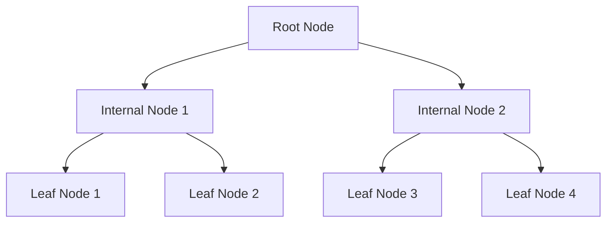

# Book Review: Database Internals

## General overview and thoughts

We tend to treat databases as a black box, understanding what's inside is crucial for modern software development. For example, when we choose a database, we need to understand what trade-offs we are making. When there is a performance problem, we need to understand where to look. This book is a good resource to understand what's inside a database.

While some parts overlap with the popular book "Designing Data-Intensive Applications", this book explains the internals in more depth. For example, the book covers B-trees and consensus algorithms in more depth.

## Summary of the book

This book consists of two parts:

- Part I: Storage Engines
- Part II: Distributed Systems

### Part I: Storage Engines

Modern databases rely on storage engines to manage how data is stored, retrieved, and maintained on disk and in memory. The Part I explores the foundational concepts, data structures, and algorithms that underpin storage engines.

#### Storage Engine Architecture

A **storage engine** is the core component responsible for the persistent storage and retrieval of data in a database system. It works alongside other database subsystems, such as the **query processor** and **execution engine**, but focuses on the low-level details of data management. Storage engines can be swapped or chosen based on workload requirements, as seen in systems like MySQL. The architecture typically includes a **transaction manager**, **lock manager**, **buffer manager**, and **recovery manager**, each handling specific responsibilities to ensure data integrity and performance.

Databases are often classified by their workload focus: **OLTP** (Online Transaction Processing) systems handle many short, concurrent transactions, while **OLAP** (Online Analytical Processing) systems are optimized for complex, long-running analytical queries. The choice of storage engine and data layout (**row-oriented**, **column-oriented**, or **wide-column**), is influenced by these workload patterns.

#### File Formats and Page Structure

Efficient data storage on disk requires careful design of file formats and page layouts. Unlike memory, disk access is slower and requires explicit management of file offsets and binary layouts. Data is stored in **pages**—fixed-size blocks (commonly 4-16 KB)—which are the basic units of I/O and caching. Pages may use the **slotted page** technique, where pointers to records are managed separately from the data itself, allowing efficient insertion, deletion, and space reclamation. Variable-sized records and free space management are handled within these pages, and binary formats are chosen for compactness and fast serialization.

#### Indexes: The Key to Efficient Data Retrieval

An **index** is a special data structure that allows the database to quickly locate and access the data you need, without having to scan every record in a table. Think of it like the index in a book, which helps you find the right page without reading the whole book.

Indexes are essential for performance, especially as databases grow larger. There are two main types:

- **Primary Index:** Built on the main data file, usually based on the primary key. It determines the physical order of data on disk.
- **Secondary Index:** Built on other columns, allowing fast lookups that aren't based on the primary key. These indexes point to the location of the data or to the primary index.

By using indexes, databases can efficiently answer queries, enforce uniqueness, and speed up sorting and filtering operations. The choice of index structure—such as **B-trees** or **hash tables**—affects how quickly data can be found and how well the system performs under different workloads.

#### B-Trees and B+Trees

**B-trees** are the backbone of many storage engines, providing a balanced, ordered structure for efficient point and range queries. Unlike **binary search trees** (BSTs), which can become unbalanced and degrade to linear search time in the worst case, B-trees maintain balance and ensure consistently efficient operations. BSTs also have low **fan-out** (each node has at most two children), which leads to taller trees and more disk accesses—an important consideration for on-disk data structures. In contrast, B-trees have high fan-out, resulting in shorter trees and fewer disk reads required for lookups, making them much better suited for storage engines.

**B+trees**, a common variant, store all values at the leaf level, with internal nodes holding only keys. This design supports efficient range scans and bulk operations.

B-trees are organized into **nodes** (pages), each containing keys and pointers. Operations like search, insert, and delete are performed by traversing from the root to the leaves, using binary search within nodes. The time complexity for these operations is O(log n), where n is the number of keys in the tree, since the tree height grows logarithmically with the number of entries. When nodes become full, they are split; when underfilled, they may be merged or rebalanced. Real-world implementations include optimizations like **page compression**, **sibling links**, and **deferred maintenance** (e.g., compaction and vacuuming) to improve space utilization and performance.



#### B-Tree Variants

Several B-tree variants have been developed to address specific performance and concurrency needs:

- **Copy-on-Write B-Trees:** Nodes are immutable; updates create new copies, improving concurrency and crash safety.
- **Lazy B-Trees:** Buffer updates to reduce I/O, applying changes in batches.
- **Bw-Trees:** Separate nodes into smaller parts and batch updates, reducing write amplification.
- **Cache-Oblivious B-Trees:** Designed to perform efficiently across different memory hierarchies.

These variants often differ in how they handle concurrency, on-disk representation, and maintenance processes, but all aim to balance read and write performance.

#### Log-Structured Merge Trees

**Log-structured merge trees** (**LSM-trees**) are designed for write-heavy workloads. Instead of updating records in place, they buffer writes in memory (the **memtable**) and periodically flush them to disk as immutable, sorted files (**SSTables**). Over time, these files are merged in the background to reclaim space and maintain order. This approach favors sequential writes, which are faster on disk, and allows high write throughput at the cost of more complex reads and background maintenance.

LSM-trees use additional data structures like **Bloom filters** (to quickly check if a key might exist) and **skip lists** (for efficient in-memory sorting). Deletes are handled by writing special markers called **tombstones**, which are reconciled during merges.

```mermaid
graph TD
    A[MemTable (in-memory)] --> B[SSTable 1 (disk)]
    A --> C[SSTable 2 (disk)]
    B --> D[Compaction]
    C --> D
```

#### Transaction Processing and Recovery

**Transactions** are the backbone of reliable database systems, ensuring that groups of operations are executed safely and predictably. The guarantees provided by transactions are encapsulated in the **ACID** properties:

- **Atomicity:** Ensures that a transaction is treated as a single, indivisible unit. Either all operations within the transaction are completed successfully, or none are applied. If any part of the transaction fails, the system rolls back all changes, leaving the database in its original state.
- **Consistency:** Guarantees that a transaction brings the database from one valid state to another, maintaining all predefined rules, constraints, and invariants. While the database enforces some consistency (such as referential integrity), application logic is often responsible for ensuring that business rules are not violated.
- **Isolation:** Controls how and when the effects of one transaction become visible to others. Proper isolation ensures that concurrently executing transactions do not interfere with each other, making it appear as if transactions are executed serially, even when they run in parallel.
- **Durability:** Once a transaction is committed, its changes are permanent, even in the event of a system crash or power failure. This is typically achieved by persisting changes to stable storage before acknowledging the commit.

To implement these properties, storage engines rely on several key components: the transaction manager (to coordinate operations), lock manager (to control concurrent access), buffer manager (to handle in-memory data), and **log manager** (to record changes for recovery).

#### Concurrency Control Approaches

**Concurrency control** is essential for maintaining data integrity when multiple transactions execute simultaneously. There are three primary approaches:

- **Optimistic Concurrency Control:** Assumes conflicts are rare. Transactions execute without restrictions, but before committing, the system checks for conflicts. If a conflict is detected, the transaction is rolled back. This approach is efficient for workloads with few conflicts.
- **Pessimistic Concurrency Control:** Assumes conflicts are likely. Transactions acquire locks on data before accessing it, blocking other transactions from making conflicting changes. The most common technique is **Two-Phase Locking (2PL)**, where all locks are acquired before any are released, ensuring serializability but potentially reducing concurrency.
- **Multi-Version Concurrency Control (MVCC):** Maintains multiple versions of data, allowing readers to access a consistent snapshot while writers update data in parallel. This reduces contention and improves performance, especially for read-heavy workloads.

#### Read and Write Anomalies

When transactions run concurrently, certain anomalies can occur if isolation is not properly enforced:

- **Dirty Read:** A transaction reads data written by another transaction that has not yet committed. If the other transaction rolls back, the first transaction has read invalid data.
- **Non-Repeatable Read:** A transaction reads the same row twice and gets different results because another transaction modified and committed the row in between the reads.
- **Phantom Read:** A transaction re-executes a query returning a set of rows and finds that the set has changed due to another transaction's insert, update, or delete.
- **Lost Update:** Two transactions read the same data and update it independently. The last write overwrites the first, causing one update to be lost.
- **Dirty Write:** A transaction overwrites uncommitted changes made by another transaction.
- **Write Skew:** Two transactions read overlapping data and make changes that, when combined, violate a database invariant, even though each transaction individually preserves it.

#### Isolation Levels

Databases offer different **isolation levels** to balance performance and correctness. Each level allows or prevents certain anomalies:

- **Read Uncommitted:** The lowest isolation. Transactions can see uncommitted changes from others (dirty reads). All anomalies are possible.
- **Read Committed:** Transactions only see committed changes from others, preventing dirty reads. However, non-repeatable and phantom reads can still occur.
- **Repeatable Read:** Ensures that if a transaction reads a row, it will see the same data if it reads it again (no non-repeatable reads). Phantom reads may still occur.
- **Serializable:** The highest isolation. Transactions are executed in a way that produces the same result as some serial execution. All anomalies are prevented, but this level can significantly reduce concurrency and throughput.

To enforce durability and enable recovery, storage engines use a **Write-Ahead Log (WAL)**, which records all changes before they are applied to the main data files. In the event of a crash, the WAL can be replayed to restore the database to a consistent state.

### Part II: Distributed Systems

As data volumes and user demands grow, databases increasingly rely on distributed systems. The Part II explores the essential concepts and mechanisms that make distributed databases possible.

#### Distributed System Fundamentals

A **distributed database system** consists of multiple **nodes** (or **replicas**), each with its own local state, communicating over a network. These systems are designed to increase storage capacity, improve performance, and enhance reliability. Distributed systems serve several purposes: **coordination** (supervising workers), **cooperation** (jointly completing tasks), **dissemination** (spreading information), and **consensus** (agreeing on shared values or actions). However, they must also handle the realities of unreliable networks, node failures, and the challenge of keeping data consistent across many machines.

#### Failure Detection

**Failure detection** is crucial for maintaining the health and safety of a distributed system. **Failure detectors** monitor the status of nodes using techniques like periodic pings or **heartbeats**. If a node fails to respond within a certain time, it may be considered unreachable or failed. More advanced detectors, such as **φ-accurate failure detectors**, estimate the probability of failure based on recent communication patterns. **Gossip-based** approaches allow nodes to share information about failures, improving detection accuracy and resilience.

#### Leader Election

Many distributed algorithms require a **leader**—a node responsible for coordinating actions or making decisions. **Leader election** algorithms ensure that, even if the current leader fails, a new one can be chosen. Common approaches include:

- **Bully Algorithm:** Nodes with higher IDs can take over leadership if they detect a failure.
- **Invitation Algorithm:** Nodes form groups and merge them to elect a leader.
- **Ring Algorithm:** Nodes are organized in a ring and pass election messages until a leader is chosen.

These algorithms help reduce synchronization overhead and ensure smooth operation in the face of failures.

#### Replication and Fault Tolerance

**Replication** involves maintaining multiple copies of data across different nodes to ensure availability and fault tolerance. If one node fails, others can continue serving requests. However, updating multiple replicas introduces trade-offs between consistency and availability, especially in the presence of network partitions.

#### The CAP Theorem

The **CAP theorem** states that a distributed system can only guarantee two out of three properties at the same time:

- **Consistency:** All nodes see the same data at the same time.
- **Availability:** Every request receives a response (even if it's not the latest data).
- **Partition Tolerance:** The system continues to operate even if network failures split the cluster into isolated parts.

| Model | Consistency | Availability | Partition Tolerance |
| ----- | ----------- | ------------ | ------------------- |
| CA    | Yes         | Yes          | No                  |
| CP    | Yes         | No           | Yes                 |
| AP    | No          | Yes          | Yes                 |

In practice, partition tolerance is essential, so systems must choose between consistency and availability during network splits.

#### Consistency Models

Distributed systems offer a range of consistency guarantees, each balancing correctness and performance:

- **Strict Consistency:** Every write is instantly visible to all nodes (impractical in real systems).
- **Linearizability:** Operations appear to occur in a single, global order.
- **Sequential Consistency:** Each process sees operations in the order they were issued, but global order may differ.
- **Causal Consistency:** Only causally related operations must be seen in the same order by all nodes.
- **Session Models:** Focus on the client's view of the system, ensuring predictable behavior for individual users.
- **Eventual Consistency:** All replicas will eventually converge to the same value if no new updates are made. This is common in large-scale, highly available systems.

#### Anti-Entropy and Data Dissemination

To keep replicas in sync, distributed systems use various data propagation techniques:

- **Direct Notification:** One node broadcasts updates to all others.
- **Peer-to-Peer Exchange:** Nodes periodically synchronize with each other.
- **Cooperative Broadcast:** Recipients help spread updates further.

**Anti-entropy** mechanisms, such as **read repair** and **hinted handoff**, help detect and fix inconsistencies. **Merkle trees** are used to efficiently identify and reconcile differences between replicas. **Gossip protocols** spread information probabilistically, ensuring robust and reliable dissemination even in large, decentralized systems.

#### Distributed Transactions and Atomic Commitment

**Distributed transactions** require coordination across multiple nodes to ensure atomicity—all-or-nothing execution—even when operations span different machines. The main protocols are:

- **Two-Phase Commit (2PC):** A coordinator asks all participants to prepare, then to commit. If any participant cannot commit, the transaction is aborted. 2PC is simple but can block if the coordinator fails.
- **Three-Phase Commit (3PC):** Adds an extra phase to avoid blocking, allowing participants to make progress even if the coordinator fails.
- **Calvin:** Establishes a global transaction order before execution, reducing coordination overhead and improving throughput.

#### Partitioning and Consistent Hashing

To scale out, databases **partition** (or **shard**) data across multiple nodes. Each partition manages a subset of the data, and requests are routed based on a key. Partitioning strategies must consider load balancing and data distribution. **Consistent hashing** is a technique that maps data to nodes in a way that minimizes rebalancing when nodes are added or removed, reducing disruption and improving scalability.

#### Consensus Algorithms

**Consensus algorithms** enable distributed systems to agree on a single value or sequence of actions, even in the presence of failures. This is essential for tasks like leader election, transaction ordering, and state machine replication. A key concept in consensus protocols is the use of **quorums**—a majority or specified subset of nodes whose agreement is required to make decisions. Quorums ensure that even if some nodes fail or are partitioned, the system can still make progress and maintain consistency.

- **Paxos:** A classic but complex algorithm where proposers suggest values, acceptors vote (using quorums), and learners observe the outcome. Paxos uses quorums to ensure progress despite failures.
- **Raft:** Designed to be easier to understand and implement, Raft elects a leader to coordinate log replication and state changes. It guarantees that only one leader exists per term and that committed entries are preserved, also relying on quorums for elections and log commitment.

**Zookeeper Atomic Broadcast (ZAB)** is an atomic broadcast protocol used in ZooKeeper to ensure total order and atomic delivery of events. It is not a general-purpose consensus algorithm, but serves as a building block for consensus in distributed systems.
