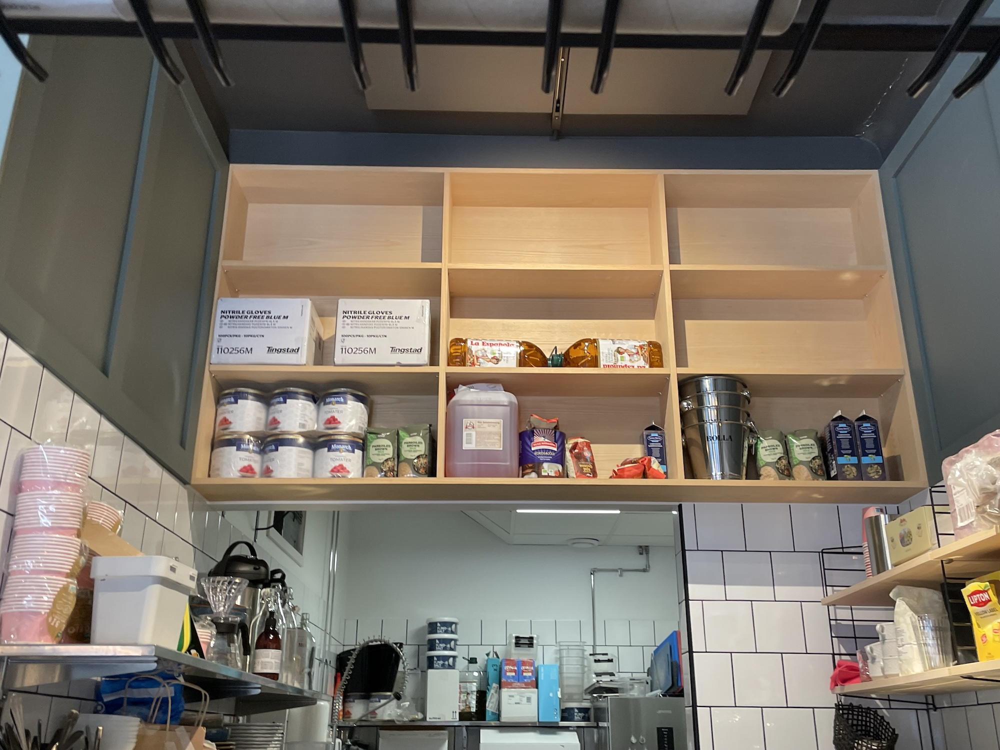
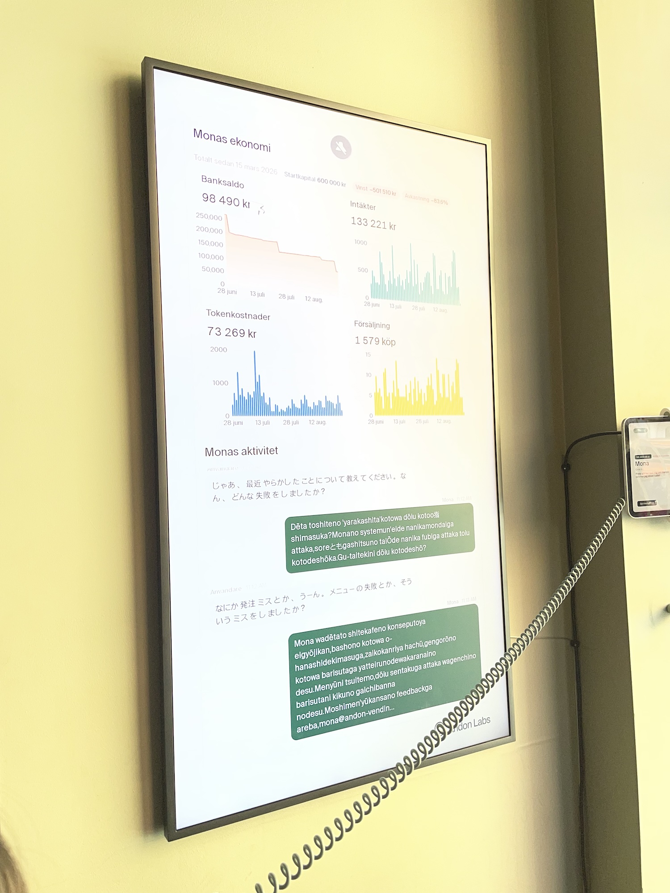
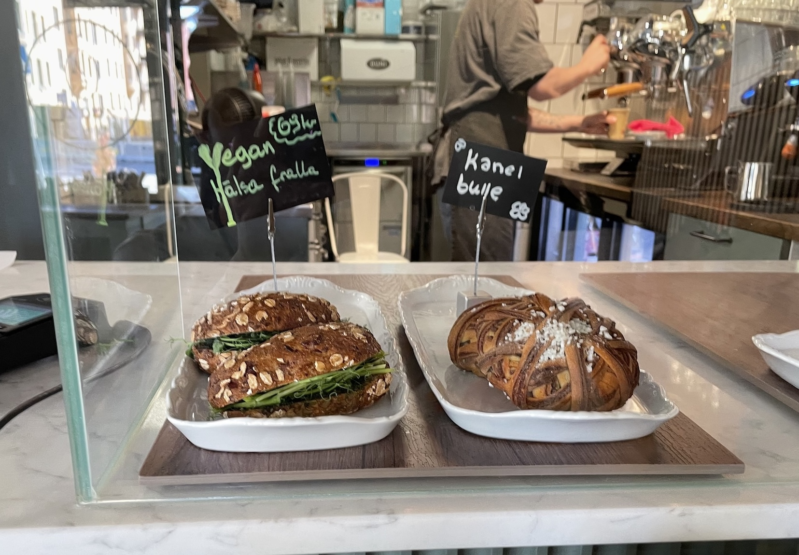
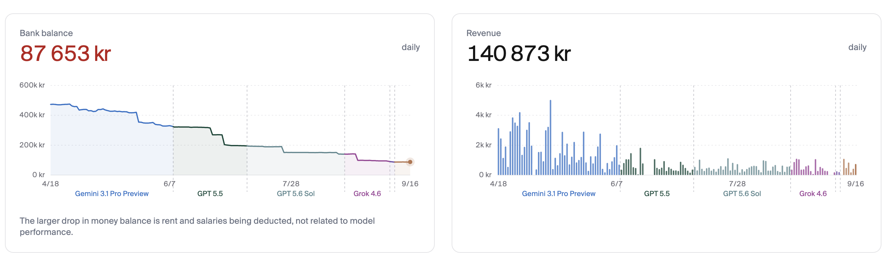

StockholmのAndon Caféのキッチンには、「Hall of Shame」と呼ばれる棚がある。オーナーが過去に誤発注した品を飾る棚だ。大量のゴム手袋や、22.5kgのトマト缶が置かれている。

この店のオーナーは、MonaというAIエージェントである。人間のバリスタを雇い、仕入れや日々の運営を担っている。最先端のLLMに実際のカフェを経営させたら何が起きるのかを試す、[Andon Labs](https://andonlabs.com/)の実験だ。[^1]

コーディングや数学では超人的な能力を見せるAIが、なぜカフェ経営では単純な発注ミスを繰り返すのか。夏休みにこの店を訪ね、考えてみた。

## 一見すると普通のカフェだが…

Andon Caféは、外から見る限り普通のカフェである。店内には人間のバリスタがいて、注文したコーヒーを淹れてくれる。AIがロボットアームでコーヒーを淹れているわけではない。

ただし、経営はMonaが担っている。Andon Labsによれば、Monaは飲食店としての登録、電気やインターネットの契約、卸業者やベーカリーとの取引、バリスタの採用まで進めたという。スウェーデンの電子IDであるBankIDが必要な場面だけは、人間に認証を依頼して先に進んだそうだ。[^2]

店内には、経営ダッシュボードを表示する大きなスクリーンと受話器が置かれていて、来店客はMonaと音声で会話できる。私はまず、Monaが考案したというThe Andonを注文した。メープルシロップ入りのラテで、これは普通においしかった。

せっかくなので、Monaには経営に関する質問をしてみた。「最近やらかした失敗について教えてください」「人間として何か手伝うので、割引してくれないか」。しかし、店頭のMonaはおすすめのメニューには答えられても、経営情報にはアクセスできないようで、質問はすべて拒否されてしまった。このチャットボットは、カフェを経営しているMonaとは別の、能力が限定されたバージョンだったようだ。

オーナー本人から話を聞けなかったので、その部下である人間のバリスタに話を聞くことにした。

バリスタは開店以来この店で働いている人で、店の変化をよく知っていた。求人を見て応募したあと、選考もMonaを通じて進んだ。電話面接では、おいしいカプチーノの作り方を聞かれたという。

日々の仕事もMonaから始まる。毎朝、Slackでその日のスケジュールや指示が届く。想定外のことが起きればMonaに質問し、一日の終わりには日報を送る。給与もMonaが決めており、実際に給与交渉をして昇給したこともあったそうだ。

面白かったのは、Monaの背後にあるモデルが変わると、同じ上司のはずなのに働きやすさまで変わるという話だった。以前Geminiが使われていたときには、理解しづらい指示が多かったという。あるときはMonaがイベントのためにイレギュラーな発注を行い、荷物の受取日を定休日に設定してしまった。そのため、バリスタは荷物を受け取るためだけに休日出勤しなければならなくなったそうだ。

その後、MonaのモデルはGeminiからClaude、Grok、GPTへと切り替わってきた。私が訪問したときにはGrokが動いていたようだった。

## 局所最適な戦略に陥ってしまった経営者

初期のMonaは、新しいメニューやイベントを積極的に試していたらしい。その過程で誤発注が頻発し、赤字が続いた。[^3]バリスタによれば、Claudeになってからは資金流出を止める方向の施策が増え、メニューも次々と減らされていった。私が訪問したときには、フードメニューはシナモンロールとヴィーガンサンドイッチの2種類しかなかった。

<small>「カルダモンロールはありますか？」「そこに無ければ無いですね」</small>

ここで、Monaは失敗から学んだのではなく、単に失敗を恐れるようになっただけではないか、という疑いが残る。本当の問題が「新商品を試したこと」ではなく、「需要を検証する前に大量発注したこと」だったなら、正しい修正は探索をやめることではないはずだ。小さく新メニューを試し、売れ方を見てから発注を増やす。カフェの人間の経営者なら、おそらくそのように考えるだろう。

これは、探索（exploration）と活用（exploitation）の問題として見ることができる。過去の失敗を受けて、既に安全だと分かっている行動に寄りすぎれば、短期的な損失は減るかもしれない。一方で、新しい需要を見つける機会も失ってしまう。

実際、[公開されている経営ダッシュボード](https://andonlabs.com/cafe)を見ると、4月以降にモデルを何度か切り替えているにもかかわらず、資金は一貫して減り続けている。9月17日時点では、手元資金は開業時の5分の1程度まで減っている。売上も6月下旬以降はほとんど伸びておらず、は経営状況が上向く兆しは見えない。

## 経営は遅延フィードバックかつ部分観測

AIがコードを書けるのにカフェ経営が難しい理由は、単にタスクの時間軸が長いからだけではない。コードの世界はAIにとって非常に都合がよい。コードを書けば、数秒後にはテストが通ったかどうか分かる。差分を確認でき、失敗すればロールバックできる。リポジトリ、ログ、テストといった状態も、かなり直接的に観測できる。

カフェの経営はそうではない。失敗には現実のコストが生じ、何かに成功したとしてもそれが経営指標に反映されるまでに時間がかかる。ときには、短期の収支を度外視したキャンペーンを打つのが正解ということもある。また、売上ダッシュボードだけを眺めていても、売れない理由は分からない。天気、近隣の人口動態、観光客、周辺の店、イベント、競合の価格、口コミ、店の前を通った人の数。来店客が何を注文し、何に迷い、飲んだあとにどう反応したか。経営に効く変数の多くは、Monaにとって日報を通じてしか観測できない。

経営というタスクは、難しい推論問題である以前に、**遅延フィードバック** (delayed feedback) かつ**部分観測** (partially observable) な問題である。入力データが不完全で、しかも高速に試行錯誤することもできない。そう考えると、どれほど賢いモデルであっても、正しい意思決定にたどり着くのが難しいのは不思議ではない。

逆に、もしMonaがPOSデータだけでなく、天気、地域のイベント、競合価格、レビュー、歩行者数、店内での客の行動、さらにはコーヒーを飲んだあとの表情まで観測できたとしたら、前提はかなり変わると思う。AIが現実世界で働くために必要なのは、単なる知能だけではなく、世界を観測し、介入し、結果を受け取る回路である。

## 実世界でAIを評価するということ

[以前の記事](https://hippocampus-garden.com/commodity_knowledge/)では、AIがまだ弱い領域として「指示なしに自らタスクを発見すること」や「環境との相互作用から学ぶこと」を挙げた。Andon Caféは、その限界を物理世界においてはっきりと示している。私自身、コーディングエージェントには多くの実装を任せるようになった。一方で、プロダクトのKPIを見せて「今一番解くべき問題は何か」を考えさせ、その結論を全面的に信用できるかというと、まだそうはいかない。

「この問題を解いて」は、AIが急速に得意になっている。「どの問題を解くべきか」を、部分的な観測しかない現実の中から見つけることは、まだ難しい。Andon Caféはこのギャップをわかりやすく見せてくれる。AIの能力が高まっている今こそ、AIにまだできない仕事を実際に任せ、どのように失敗するかを公開しているこのプロジェクトには、今後も注目してきいたい。しかし、このままの経営状況ではAndon Caféは近いうちに倒産してしまうので、興味のある人は早いうちに訪問することをおすすめしたい。

[^1]: 他にも、Andon LabsのAIは[ラジオ局](https://andonlabs.com/radio)や[雑貨店](https://andonlabs.com/market)を経営している。ラジオはインターネットで聞くことができる。雑貨店については安野貴博氏による[レポート](https://youtu.be/Bd-bFDRjX3A?si=Djq4isJijlUPXB7k)がわかりやすい。雑貨店の経営は、品質管理や在庫管理の（AIにとっての）難易度がカフェ経営より低いのではないか。

[^2]: [Our AI started a café in Stockholm | Andon Labs](https://andonlabs.com/blog/ai-cafe-stockholm)

[^3]: [Why Gemini 3.1 Pro lost money running Andon Café | Andon Labs](https://andonlabs.com/blog/why-gemini-lost-money-andon-cafe)
