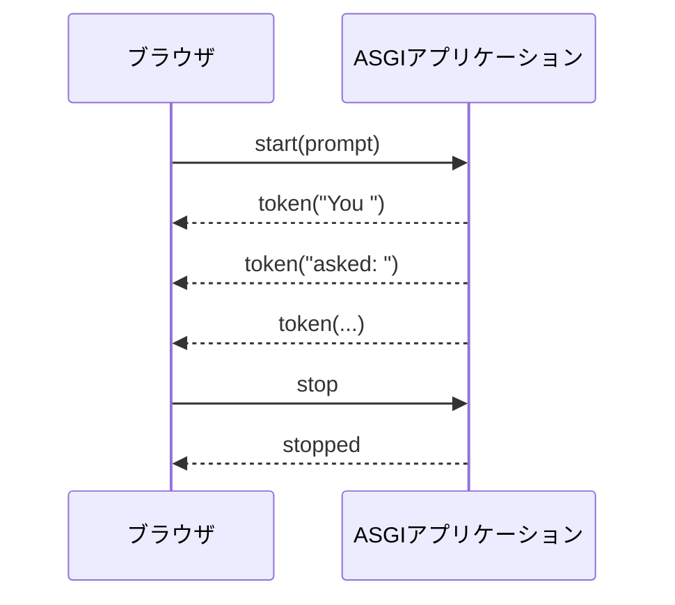

私はいま、AIアプリケーションを支える技術スタックを学んでいます。[前回の記事](/wsgi_asgi/)では、LLM APIの応答を待つAIエージェントを題材に、WSGIとASGIを比較しました。そこで分かったのは、両者の違いを単に同期Pythonと非同期Pythonの違いとして捉えるだけでは不十分だということです。WSGIは一つのHTTPリクエストを一回の関数呼び出しとして表現する一方、ASGIは接続中の通信を一連のイベントとして表現します。

しかし、この説明だけではASGIのイベントモデルによって何ができるようになるのか、まだ具体的にイメージできませんでした。

この疑問を考える題材として、WebSocketはちょうどよさそうです。WebSocketでは一度確立した接続が維持され、その接続中にクライアントとサーバーのどちらからでも何度もメッセージを送れます。この通信パターンは、対話的なAIアプリケーションにも現れます。ユーザーがpromptを送り、サーバーが生成したtokenを少しずつ返し、生成が終わる前にユーザーがStopを押す、という場面です。

この記事では、この一連の操作をLLM APIやWebフレームワークを使わずに実装します。サーバーは`asyncio.sleep()`を使って、固定された文章をtokenごとに生成します。外部APIを呼ばないことで、WebSocketとASGIの動きだけに注目できるようにします。

## 今回作るもの

今回のアプリケーションでは、次の三つのやり取りを実装します。

1. ブラウザがpromptを含む`start`メッセージを送る
2. サーバーが複数の`token`メッセージを送り、最後に`done`を送る
3. tokenの受信中でも、ブラウザから`stop`を送れるようにする



外部サービスやAPI keyは不要です。必要なのはPython、Uvicorn、ブラウザだけです。

## 実験の準備

次の三つのファイルを置くディレクトリを作ります。

```text
websocket-ai-chat/
├── app.py
├── index.html
└── requirements.txt
```

この記事のコードは、Python 3.10.9と次の依存関係で動作を確認しました。

```text
# requirements.txt
uvicorn[standard]==0.52.1
```

`standard`を指定すると、ASGIサーバー本体に加えて、Uvicornが利用するWebSocket実装もインストールされます。

仮想環境を作り、依存パッケージをインストールします。

```bash
uv venv --python 3.10
source .venv/bin/activate
uv pip install -r requirements.txt
```

## ブラウザクライアントを作る

ブラウザ側では、標準の[`WebSocket`](https://developer.mozilla.org/en-US/docs/Web/API/WebSocket) APIを使います。これはSocket.IOで使う`io()`とは別のものです。`WebSocket`はブラウザに組み込まれていますが、`io()`はSocket.IOのクライアントライブラリが提供する関数です。

次の内容を`index.html`として保存します。

```html
<!doctype html>
<html lang="en">
  <head>
    <meta charset="UTF-8" />
    <meta name="viewport" content="width=device-width, initial-scale=1" />
    <title>Raw ASGI WebSocket Chat</title>
    <style>
      body {
        max-width: 720px;
        margin: 3rem auto;
        padding: 0 1rem;
        font:
          16px/1.5 system-ui,
          sans-serif;
      }
      form {
        display: flex;
        gap: 0.5rem;
      }
      input {
        flex: 1;
        padding: 0.7rem;
      }
      button {
        padding: 0.7rem 1rem;
      }
      #output {
        min-height: 8rem;
        padding: 1rem;
        border: 1px solid #aaa;
        white-space: pre-wrap;
      }
      #status {
        color: #555;
      }
    </style>
  </head>
  <body>
    <h1>Raw ASGI WebSocket Chat</h1>
    <p id="status">Connecting...</p>

    <form id="chat-form">
      <input id="prompt" value="Why does ASGI fit WebSockets?" />
      <button id="send" type="submit" disabled>Send</button>
      <button id="stop" type="button" disabled>Stop</button>
    </form>

    <h2>Response</h2>
    <div id="output"></div>

    <script>
      const websocketProtocol = location.protocol === "https:" ? "wss" : "ws"
      const socket = new WebSocket(`${websocketProtocol}://${location.host}/ws`)

      const form = document.querySelector("#chat-form")
      const prompt = document.querySelector("#prompt")
      const sendButton = document.querySelector("#send")
      const stopButton = document.querySelector("#stop")
      const output = document.querySelector("#output")
      const status = document.querySelector("#status")

      socket.addEventListener("open", () => {
        status.textContent = "Connected with WebSocket"
        sendButton.disabled = false
      })

      socket.addEventListener("message", (event) => {
        const message = JSON.parse(event.data)

        if (message.type === "token") {
          output.textContent += message.value
        } else if (message.type === "done") {
          status.textContent = "Generation complete"
          sendButton.disabled = false
          stopButton.disabled = true
        } else if (message.type === "stopped") {
          status.textContent = "Generation stopped"
          sendButton.disabled = false
          stopButton.disabled = true
        } else if (message.type === "error") {
          status.textContent = message.message
          sendButton.disabled = false
          stopButton.disabled = true
        }
      })

      socket.addEventListener("close", () => {
        status.textContent = "Disconnected"
        sendButton.disabled = true
        stopButton.disabled = true
      })

      form.addEventListener("submit", (event) => {
        event.preventDefault()
        output.textContent = ""
        status.textContent = "Generating..."
        sendButton.disabled = true
        stopButton.disabled = false
        socket.send(JSON.stringify({ type: "start", prompt: prompt.value }))
      })

      stopButton.addEventListener("click", () => {
        socket.send(JSON.stringify({ type: "stop" }))
      })
    </script>
  </body>
</html>
```

ブラウザとサーバーは、WebSocket上でJSONメッセージを交換します。`start`、`token`、`stop`といった名前はWebSocket仕様に含まれるものではありません。今回の実験のために定義した、小さなアプリケーションレベルのプロトコルです。

## 素のASGIアプリケーションを作る

続いて、次の内容を`app.py`として保存します。

```python
from __future__ import annotations

import asyncio
import json
from contextlib import suppress
from pathlib import Path
from typing import Any, Awaitable, Callable


INDEX_HTML = Path(__file__).with_name("index.html").read_bytes()

Receive = Callable[[], Awaitable[dict[str, Any]]]
Send = Callable[[dict[str, Any]], Awaitable[None]]


async def app(scope: dict[str, Any], receive: Receive, send: Send) -> None:
    """A framework-free ASGI application for HTTP, WebSocket, and lifespan."""
    if scope["type"] == "lifespan":
        await handle_lifespan(receive, send)
    elif scope["type"] == "http":
        await handle_http(scope, send)
    elif scope["type"] == "websocket":
        await handle_websocket(scope, receive, send)
    else:
        raise ValueError(f"Unsupported scope type: {scope['type']}")


async def handle_lifespan(receive: Receive, send: Send) -> None:
    while True:
        event = await receive()
        if event["type"] == "lifespan.startup":
            await send({"type": "lifespan.startup.complete"})
        elif event["type"] == "lifespan.shutdown":
            await send({"type": "lifespan.shutdown.complete"})
            return


async def handle_http(scope: dict[str, Any], send: Send) -> None:
    if scope["method"] == "GET" and scope["path"] == "/":
        status = 200
        body = INDEX_HTML
        content_type = b"text/html; charset=utf-8"
    else:
        status = 404
        body = b"Not found"
        content_type = b"text/plain; charset=utf-8"

    await send(
        {
            "type": "http.response.start",
            "status": status,
            "headers": [
                (b"content-type", content_type),
                (b"content-length", str(len(body)).encode()),
            ],
        }
    )
    await send({"type": "http.response.body", "body": body})


async def handle_websocket(
    scope: dict[str, Any], receive: Receive, send: Send
) -> None:
    event = await receive()
    print("<-", event["type"])
    if event["type"] != "websocket.connect":
        return

    if scope["path"] != "/ws":
        await send({"type": "websocket.close", "code": 1008})
        return

    await send({"type": "websocket.accept"})
    print("-> websocket.accept")

    generation_task: asyncio.Task[None] | None = None

    try:
        while True:
            event = await receive()
            print("<-", event["type"])

            if event["type"] == "websocket.disconnect":
                break

            if event["type"] != "websocket.receive" or "text" not in event:
                continue

            try:
                message = json.loads(event["text"])
            except json.JSONDecodeError:
                await send_json(send, {"type": "error", "message": "Invalid JSON"})
                continue

            if message.get("type") == "start":
                prompt = str(message.get("prompt", "")).strip()
                if not prompt:
                    await send_json(
                        send, {"type": "error", "message": "Prompt is empty"}
                    )
                elif generation_task is not None and not generation_task.done():
                    await send_json(
                        send,
                        {"type": "error", "message": "Generation already running"},
                    )
                else:
                    generation_task = asyncio.create_task(
                        stream_fake_response(prompt, send)
                    )

            elif message.get("type") == "stop":
                if generation_task is not None and not generation_task.done():
                    generation_task.cancel()
                    with suppress(asyncio.CancelledError):
                        await generation_task
                    generation_task = None
                    await send_json(send, {"type": "stopped"})
    finally:
        if generation_task is not None and not generation_task.done():
            generation_task.cancel()
            with suppress(asyncio.CancelledError):
                await generation_task


async def stream_fake_response(prompt: str, send: Send) -> None:
    response = (
        f"You asked: {prompt}. "
        "This response is generated locally, one token at a time, "
        "without calling an LLM API."
    )

    try:
        for token in response.split():
            await asyncio.sleep(0.25)
            await send_json(send, {"type": "token", "value": token + " "})
        await send_json(send, {"type": "done"})
    except OSError:
        # The connection can close just before websocket.disconnect is received.
        return


async def send_json(send: Send, message: dict[str, Any]) -> None:
    print("->", message["type"])
    await send({"type": "websocket.send", "text": json.dumps(message)})
```

`generation_task.cancel()`を呼んでも、taskはその場で強制終了するわけではありません。次にtaskへ制御が戻る`await`地点（この例では多くの場合`await asyncio.sleep()`）で`asyncio.CancelledError`が発生し、task内の後処理を実行する機会が与えられます。そのtaskを`await`すると、呼び出し側にも`CancelledError`が伝わります。ここではキャンセルが意図した動作なので、`suppress(asyncio.CancelledError)`でその例外だけを無視し、WebSocket handlerの処理を続けています。[^cancel]

フレームワークを使ったecho serverよりコードは長くなりますが、その代わりにASGIの動きをほぼすべて確認できます。このアプリケーションは三種類のASGI scopeを処理します。

- `lifespan`では、起動と終了が完了したことをUvicornに伝える
- `http`では、`GET /`に対して`index.html`を返す
- `websocket`では、`/ws`への接続を維持しながらイベントを交換する

WebSocketを試すだけなら、三種類すべてを処理する必要はありません。`websocket`だけでも実験できます。今回は一つのapplicationから`index.html`も配信するために`http`を実装し、Uvicornをdefault設定のまま起動・終了できるように`lifespan`も実装しました。HTMLを別のserverから配信し、Uvicornを`--lifespan off`で起動するなら、後者二つは省略できます。実際の開発ではframeworkやrouterがscopeの振り分けを担当します。

## アプリケーションを動かす

三つのファイルを置いたディレクトリでUvicornを起動します。

```bash
uvicorn app:app --host 127.0.0.1 --port 8000
```

ブラウザで次のURLを開きます。

```text
http://127.0.0.1:8000/
```

Sendを押すと、response欄に文章がtoken単位で少しずつ表示されます。表示が終わる前にStopを押すと、その時点でストリーミングが止まります。

サーバー側には、ASGIイベントとアプリケーションのメッセージが表示されます。

```text
<- websocket.connect
-> websocket.accept
<- websocket.receive
-> token
-> token
-> token
<- websocket.receive
-> stopped
```

二つの`websocket.receive`イベントには、それぞれ`start`と`stop`のメッセージが入っています。ASGIサーバーはWebSocket frameをすでにdecodeしており、アプリケーションには完全なtext messageを渡します。逆方向では、アプリケーションが`websocket.send`を使ってメッセージの送信を依頼します。アプリケーション自身がWebSocket frameを組み立てるわけではありません。

[ASGIのHTTP・WebSocket仕様](https://asgi.readthedocs.io/en/latest/specs/www.html#websocket)では、この責任分担が定義されています。Uvicornはhandshake、frame、PING/PONG message、network socketを処理します。アプリケーションが受け取ったり送ったりするのは、ASGIイベントを表す辞書です。

## 一つの接続で二つの処理を並行する

この実験で重要なのは、生成される文章の内容ではありません。メッセージを受け取るloopと、文章を生成するtaskの関係です。

受信loopは、ブラウザからのメッセージを待ちます。

```python
while True:
    event = await receive()
```

それとは別に、生成taskは待機を挟みながらtokenを送ります。

```python
for token in response.split():
    await asyncio.sleep(0.25)
    await send_json(send, {"type": "token", "value": token + " "})
```

`asyncio.create_task()`を使うことで、二つの処理を一つのevent loop上で進められます。token生成が`await asyncio.sleep()`に到達して待機している間に、受信loopは`stop`メッセージを処理できます。逆に、受信loopが次のブラウザメッセージを待っている間には、生成taskが次のtokenを送れます。

ここで、ASGIの接続を中心としたイベントモデルが具体的に見えてきます。WebSocket接続が続く間、application callableも終了しません。その間に複数のイベントを受け取り、複数のイベントを送り、接続に関連するtaskを実行できます。

ブラウザが切断すると、`receive()`は`websocket.disconnect`を返します。すると`finally` blockが生成taskをcancelし、すでにいなくなったclientのために処理を続けることを防ぎます。実際のAIアプリケーションであれば、同じ後処理によってLLMのstreamやtool callを中断できるでしょう。

## 標準WSGIではこの接続を表現できない

WSGIアプリケーションは`environ`と`start_response`を引数として呼び出され、iterableなresponse bodyを返します。

```python
def application(environ, start_response):
    start_response("200 OK", [("Content-Type", "text/plain")])
    return [b"Hello"]
```

このinterfaceでも、bodyのchunkを複数回yieldすることでHTTP responseをstreamingできます。しかし、今回のコードにある受信側の処理は表現できません。response headerを返したあと、WSGIには次のコードに相当するものがありません。

```python
event = await receive()
```

したがって、upgrade後の接続上で`stop`を新しいイベントとして受け取るための、portableな方法がありません。また、標準WSGIはアプリケーションが`Upgrade`のようなhop-by-hop headerを生成することも禁止しています。これはWebSocket handshakeに必要なheaderです。[^wsgi]

ただし、これはFlaskアプリケーションではWebSocketのような機能を提供できない、という意味ではありません。Flask-SocketIOは、WSGIを通じてHTTP long-pollingを使うことも、対応するserverや追加libraryが提供するWebSocket機能を使うこともできます。[^flask-socketio] ここでの違いは、WebSocket接続そのものを標準WSGIのapplication interfaceが表現しているわけではない、という点です。

## WebSocketなしでも同じAIチャットを作れるか

作れます。画面上の操作だけでは、背後で使われているprotocolは決まりません。

たとえば、次の組み合わせでも実装できます。

1. `POST /generate`でpromptを送る
2. Server-Sent Events（SSE）またはHTTP streaming responseでtokenを受け取る
3. `POST /cancel`で生成を止める

long-pollingを使う方法もあります。ブラウザが繰り返しHTTP requestを作り、サーバーは送るメッセージができるまでresponseを返さずに保持します。これらの方法は、一つの双方向WebSocket接続ではなく、複数のHTTP requestを組み合わせます。

| 要件                                    | HTTP streaming / SSE | Long-polling         | WebSocket        |
| --------------------------------------- | -------------------- | -------------------- | ---------------- |
| サーバーからブラウザへtokenをstreamする | できる               | できる               | できる           |
| ブラウザからpromptを送る                | 別のrequestが必要    | POST request         | 同じ接続を使える |
| streaming中にStopを送る                 | 別のrequestが必要    | POST request         | 同じ接続を使える |
| 両方向に頻繁にメッセージを送る          | 扱いにくい           | できるがoverheadあり | 自然に表現できる |
| 標準WSGI interfaceを通じて動く          | 動く                 | 動く                 | 動かない         |

promptを一度送り、tokenを一方向に受け取るだけのtext chatなら、HTTP streamingやSSEのほうが単純かもしれません。live voice input、途中までのtranscript、toolの進行状況、ユーザーによる中断、共同編集するstateなど、小さなイベントを両方向に頻繁に送る場合はWebSocketが有力になります。

<!--音声通話についても言及して-->

理由は主に通信のoverheadです。HTTP streamingやSSEでサーバーからデータを受け取りながらブラウザからもメッセージを送るには、受信用の接続とは別にHTTP requestを作る必要があります。long-pollingでは、サーバーから一つのresponseを受け取るたびに次のGET requestを開始し、ブラウザからは別のPOST requestを送ります。それぞれのrequestでHTTP headerの送信、requestのparse、routing、認証などが繰り返されます。WebSocketでは最初のhandshake後は一つの接続を再利用し、小さなframeとしてメッセージを送れるため、頻繁なやり取りでこのoverheadを抑えられます。

複数の接続を使うと、どのrequestがどの生成処理に対応するかをapplication側で管理する必要もあります。たとえば`POST /cancel`が届いたときには、session IDなどを使って、別の接続でstreaming中のtaskを特定しなければなりません。順序の入れ替わりやキャンセル完了直前のtoken送信といったrace conditionはWebSocketでも起こり得るため、これだけがWebSocketを選ぶ理由ではありません。ただし、一つの順序付けられた接続にメッセージを集約すると、接続間の対応付けは単純になります。

つまり、AIアプリケーションでは必ずWebSocketを使うべきだ、という話ではありません。必要な通信パターンに応じてprotocolを選ぶべきです。

## この実験で分かったこと

コードを書く前は、ASGIの`receive`と`send` callableを、WSGIとの抽象的な違いとして理解していました。Stop buttonを実装したことで、この違いをもう少し具体的に捉えられるようになりました。

サーバーがtokenを送っている途中でも、同じアプリケーションが別のメッセージを受け取り、生成taskをcancelできます。この接続は、一つのresponseを返す一回の関数呼び出しではありません。scopeが生き続け、その間にイベントが両方向へ移動します。

FastAPIやStarletteのようなframeworkは、より高水準なWebSocket APIを提供します。Socket.IOは独自のevent protocol、再接続、transport fallbackなどを追加します。こうした抽象化は便利ですが、今回の素の実装ではその下にあるinterfaceを確認できました。そこにあるのはconnection scope、receive callable、send callable、そして時間とともに届く一連のイベントです。

[^uv]: [uvのenvironment documentation](https://docs.astral.sh/uv/pip/environments/)では、`uv venv`による仮想環境の作成と、current directoryの`.venv`を自動検出する仕組みが説明されています。

[^cancel]: [`Task.cancel()`のdocumentation](https://docs.python.org/3/library/asyncio-task.html#task-cancellation)によると、taskの次の実行機会に`CancelledError`が送出されます。[`contextlib.suppress()`](https://docs.python.org/3/library/contextlib.html#contextlib.suppress)は、`with` block内で指定された例外だけを無視し、その直後から処理を再開するcontext managerです。

[^wsgi]: **Hop-by-hop header**は、end-to-endで最終的なclientやserverまで伝えるheaderではなく、現在のtransport connectionだけに適用されるheaderです。proxyなどのintermediaryは、次の接続へ転送する前にこれらを処理・削除します。`Connection`、`Keep-Alive`、`Transfer-Encoding`、`Upgrade`などが該当します。WebSocket handshakeでは、browserが`Connection: Upgrade`と`Upgrade: websocket`を送り、serverが`101 Switching Protocols`を返すことでHTTPからWebSocketへ切り替えます。しかし、WSGI serverとapplicationはHTTP messageそのものを交換しているわけではありません。そのため[PEP 3333](https://peps.python.org/pep-3333/#other-http-features)は、WSGI applicationがhop-by-hop headerを生成したり、`environ`内のhop-by-hop headerに依存したりすることを禁止し、対応する場合はserver側で処理するものとしています。

[^flask-socketio]: ここではFlask-SocketIOと、その下で動くEngine.IO、WebSocket対応server・libraryの組み合わせを指しています。Socket.IOはWebSocketそのものではなく、event、ack、room、reconnectionなどを定義する上位protocolです。transportとしてlong-pollingを選んだ場合、送受信は通常のWSGI request/responseで実現できます。一方、WebSocket transportを選ぶ場合、Flask-SocketIOは標準WSGIだけで処理するのではなく、たとえばthreaded Gunicornと`simple-websocket`、geventと`gevent-websocket`、またはuWSGIのnative WebSocket supportなどを利用します。これらは標準WSGIに含まれないsocket accessやWebSocket処理を提供します。具体的な構成は[Flask-SocketIOのdeployment documentation](https://flask-socketio.readthedocs.io/en/stable/deployment.html)で説明されています。
