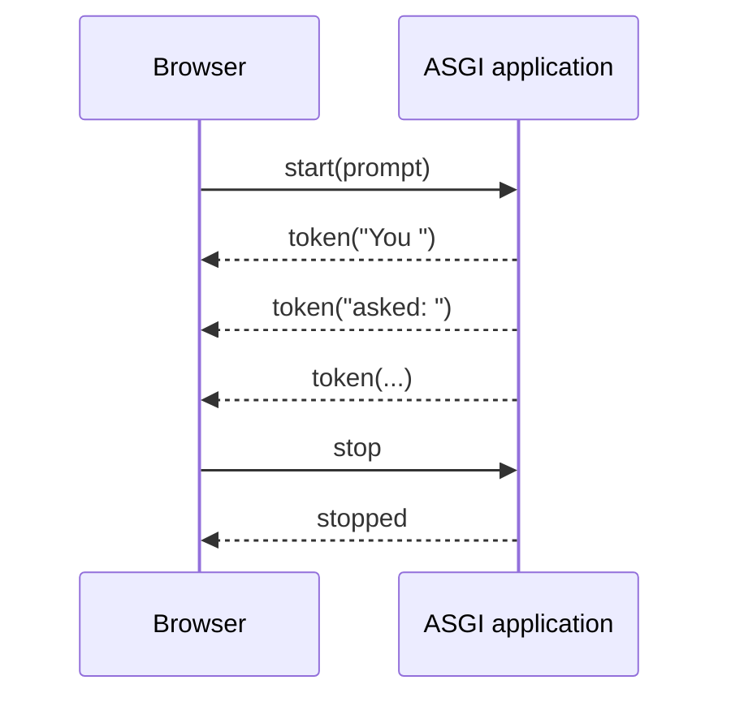

I am learning the technologies behind AI applications. In my [previous article](/wsgi_asgi/), I compared [**WSGI (Web Server Gateway Interface)**](https://peps.python.org/pep-3333/) and [**ASGI (Asynchronous Server Gateway Interface)**](https://asgi.readthedocs.io/en/latest/specs/main.html) using an AI agent that waits for a **large language model (LLM) API**. I mentioned that WSGI does not support [**WebSocket**](https://datatracker.ietf.org/doc/html/rfc6455) connections, but I did not explain why.

In this article, I will build a small two-way application with WebSockets. I will not use an LLM API or a web framework. The server will use [**`asyncio.sleep()`**](https://docs.python.org/3/library/asyncio-task.html#asyncio.sleep) to generate a fixed response one token at a time. This keeps the example focused on WebSockets and ASGI.

## What We Will Build

The application will perform three steps:

1. The browser sends a `start` message with a prompt.
2. The server sends several `token` messages, followed by `done`.
3. While tokens are arriving, the browser can send `stop` to cancel the generation.



## Set Up the Example

Create a directory with these three files:

```text
websocket-ai-chat/
├── app.py
├── index.html
└── requirements.txt
```

I tested the code with Python 3.10.9 and this dependency:

```text
# requirements.txt
uvicorn[standard]==0.52.1
```

The `standard` extra installs [**Uvicorn**](https://www.uvicorn.org/) together with the WebSocket implementation it uses. Uvicorn documents the available implementations in its [WebSocket protocol guide](https://www.uvicorn.org/concepts/websockets/).

Create a virtual environment and install the dependency:

```bash
uv venv --python 3.10
source .venv/bin/activate
uv pip install -r requirements.txt
```

## Build the Browser Client

The browser uses the standard [`WebSocket`](https://developer.mozilla.org/en-US/docs/Web/API/WebSocket) API.

Save the following code as `index.html`:

```html
<!doctype html>
<html lang="en">
  <head>
    <meta charset="UTF-8" />
    <meta name="viewport" content="width=device-width, initial-scale=1" />
    <title>Raw ASGI WebSocket Chat</title>
    <style>
      body {
        max-width: 720px;
        margin: 3rem auto;
        padding: 0 1rem;
        font:
          16px/1.5 system-ui,
          sans-serif;
      }
      form {
        display: flex;
        gap: 0.5rem;
      }
      input {
        flex: 1;
        padding: 0.7rem;
      }
      button {
        padding: 0.7rem 1rem;
      }
      #output {
        min-height: 8rem;
        padding: 1rem;
        border: 1px solid #aaa;
        white-space: pre-wrap;
      }
      #status {
        color: #555;
      }
    </style>
  </head>
  <body>
    <h1>Raw ASGI WebSocket Chat</h1>
    <p id="status">Connecting...</p>

    <form id="chat-form">
      <input id="prompt" value="Why does ASGI fit WebSockets?" />
      <button id="send" type="submit" disabled>Send</button>
      <button id="stop" type="button" disabled>Stop</button>
    </form>

    <h2>Response</h2>
    <div id="output"></div>

    <script>
      const websocketProtocol = location.protocol === "https:" ? "wss" : "ws"
      const socket = new WebSocket(`${websocketProtocol}://${location.host}/ws`)

      const form = document.querySelector("#chat-form")
      const prompt = document.querySelector("#prompt")
      const sendButton = document.querySelector("#send")
      const stopButton = document.querySelector("#stop")
      const output = document.querySelector("#output")
      const status = document.querySelector("#status")

      socket.addEventListener("open", () => {
        status.textContent = "Connected with WebSocket"
        sendButton.disabled = false
      })

      socket.addEventListener("message", (event) => {
        const message = JSON.parse(event.data)

        if (message.type === "token") {
          output.textContent += message.value
        } else if (message.type === "done") {
          status.textContent = "Generation complete"
          sendButton.disabled = false
          stopButton.disabled = true
        } else if (message.type === "stopped") {
          status.textContent = "Generation stopped"
          sendButton.disabled = false
          stopButton.disabled = true
        }
      })

      socket.addEventListener("close", () => {
        status.textContent = "Disconnected"
        sendButton.disabled = true
        stopButton.disabled = true
      })

      form.addEventListener("submit", (event) => {
        event.preventDefault()
        output.textContent = ""
        status.textContent = "Generating..."
        sendButton.disabled = true
        stopButton.disabled = false
        socket.send(JSON.stringify({ type: "start", prompt: prompt.value }))
      })

      stopButton.addEventListener("click", () => {
        socket.send(JSON.stringify({ type: "stop" }))
      })
    </script>
  </body>
</html>
```

## Build a Raw ASGI Application

Next, save the following code as `app.py`:

```python
import asyncio
import json
from contextlib import suppress
from pathlib import Path


INDEX_HTML = Path(__file__).with_name("index.html").read_bytes()


async def app(scope, receive, send):
    if scope["type"] == "http":
        await send(
            {
                "type": "http.response.start",
                "status": 200,
                "headers": [(b"content-type", b"text/html; charset=utf-8")],
            }
        )
        await send({"type": "http.response.body", "body": INDEX_HTML})
    elif scope["type"] == "websocket":
        await handle_websocket(receive, send)


async def handle_websocket(receive, send):
    event = await receive()
    print("<-", event["type"])

    await send({"type": "websocket.accept"})
    print("-> websocket.accept")

    generation_task = None

    try:
        while True:
            event = await receive()
            print("<-", event["type"])

            if event["type"] == "websocket.disconnect":
                break

            message = json.loads(event["text"])

            if message["type"] == "start":
                generation_task = asyncio.create_task(
                    stream_fake_response(message["prompt"], send)
                )
            elif message["type"] == "stop" and generation_task is not None:
                generation_task.cancel()
                with suppress(asyncio.CancelledError):
                    await generation_task
                generation_task = None
                await send_json(send, {"type": "stopped"})
    finally:
        if generation_task is not None and not generation_task.done():
            generation_task.cancel()
            with suppress(asyncio.CancelledError):
                await generation_task


async def stream_fake_response(prompt, send):
    response = (
        f"You asked: {prompt}. "
        "This response is generated locally, one token at a time, "
        "without calling an LLM API."
    )

    for token in response.split():
        await asyncio.sleep(0.25)
        await send_json(send, {"type": "token", "value": token + " "})
    await send_json(send, {"type": "done"})


async def send_json(send, message):
    print("->", message["type"])
    await send({"type": "websocket.send", "text": json.dumps(message)})
```

This application handles two ASGI [**connection scope**](https://asgi.readthedocs.io/en/latest/specs/main.html#connection-scope) types. For an `http` scope, it returns `index.html`. For a `websocket` scope, it keeps the connection open and exchanges events. We will disable Uvicorn's [**lifespan protocol**](https://asgi.readthedocs.io/en/latest/specs/lifespan.html) handling when we start the server.

Calling `generation_task.cancel()` requests [**task cancellation**](https://docs.python.org/3/library/asyncio-task.html#task-cancellation); it does not stop the task at once. Python raises `asyncio.CancelledError` the next time the task reaches an `await`, usually `await asyncio.sleep()` in this example. Awaiting the cancelled task passes the same exception to the caller. Cancellation is expected here, so `suppress(asyncio.CancelledError)` ignores that exception and lets the WebSocket handler continue.

## Run the Application

Start Uvicorn from the directory that contains the three files:

```bash
uvicorn app:app --host 127.0.0.1 --port 8000 --lifespan off
```

Open this URL in a browser:

```text
http://127.0.0.1:8000/
```

Click Send. The response appears one token at a time. Click Stop before it finishes, and the stream stops at that point.

<video controls muted playsinline preload="metadata" style="display: block; width: 100%;">
  <source src="/websocket_asgi_ai_chat/demo.m4v" type="video/mp4" />
  Your browser does not support this video. You can <a href="/websocket_asgi_ai_chat/demo.m4v">open the demo directly</a>.
</video>

The server prints the ASGI events and the messages sent by the application:

```text
<- websocket.connect
-> websocket.accept
<- websocket.receive
-> token
-> token
-> token
<- websocket.receive
-> stopped
```

The two `websocket.receive` events contain the `start` and `stop` messages. The ASGI server has already decoded the [**WebSocket frames**](https://datatracker.ietf.org/doc/html/rfc6455#section-5), so the application receives complete text messages. In the other direction, the application asks the server to send a message with `websocket.send`. The application does not build WebSocket frames itself.

The [ASGI HTTP and WebSocket specification](https://asgi.readthedocs.io/en/latest/specs/www.html#websocket) defines this division of work. Uvicorn handles the [**opening handshake**](https://www.uvicorn.org/concepts/websockets/#upgrade-process), frames, PING/PONG messages, and the network socket. The application only sends and receives dictionaries that represent ASGI events.

## Run Two Tasks over One Connection

The important part of this example is the relationship between the message loop and the generation task.

The message loop waits for input from the browser:

```python
while True:
    event = await receive()
```

At the same time, the generation task waits between tokens and sends them to the browser:

```python
for token in response.split():
    await asyncio.sleep(0.25)
    await send_json(send, {"type": "token", "value": token + " "})
```

[`asyncio.create_task()`](https://docs.python.org/3/library/asyncio-task.html#asyncio.create_task) lets both tasks make progress on one [**event loop**](https://docs.python.org/3/library/asyncio-eventloop.html). While token generation is waiting at `await asyncio.sleep()`, the message loop can process `stop`. While the message loop is waiting for the next browser message, the generation task can send another token.

This makes ASGI's connection-based event model easier to see. The application callable stays active for as long as the WebSocket connection is open. During that time, it can receive many events, send many events, and run tasks related to the connection.

When the browser disconnects, `receive()` returns `websocket.disconnect`. The `finally` block then cancels the generation task. This prevents the server from continuing work for a client that is no longer connected. In a real AI application, similar cleanup could stop an LLM stream or a tool call.

## Standard WSGI Cannot Represent This Connection

A WSGI application is called with `environ` and `start_response`, and it returns an iterable response body:

```python
def application(environ, start_response):
    start_response("200 OK", [("Content-Type", "text/plain")])
    return [b"Hello"]
```

The response iterable can yield several chunks, so WSGI supports HTTP response streaming. However, it cannot represent the receiving side of our example. After the response headers have been sent, WSGI has no equivalent of this line:

```python
event = await receive()
```

As a result, a standard WSGI application has no portable way to receive `stop` as a new event over an upgraded connection. WSGI also prevents applications from producing **hop-by-hop headers** such as `Upgrade`, which is part of the WebSocket handshake.[^wsgi]

This does not mean that a Flask application cannot provide WebSocket-like features. Flask-SocketIO can use HTTP long-polling through WSGI. It can also use WebSockets when the server or an extra library provides the required support.[^flask-socketio] The key point is that the standard WSGI application interface does not represent the WebSocket connection itself.

## Could We Build the Same Chat without WebSockets?

Yes. For example, we could use three HTTP operations:

1. Send the prompt with `POST /generate`.
2. Receive tokens with [**Server-Sent Events (SSE)**](https://developer.mozilla.org/en-US/docs/Web/API/Server-sent_events) or an [**HTTP streaming**](https://developer.mozilla.org/en-US/docs/Web/API/Streams_API) response.
3. Stop generation with `POST /cancel`.

[**Long-polling**](https://datatracker.ietf.org/doc/html/rfc6202) is another option. The browser repeatedly creates HTTP requests, and the server keeps each response open until it has a message to send. These approaches combine several HTTP requests instead of using one two-way WebSocket connection.

| Requirement                               | HTTP streaming / SSE  | Long-polling                 | WebSocket               |
| ----------------------------------------- | --------------------- | ---------------------------- | ----------------------- |
| Stream tokens from server to browser      | Yes                   | Yes                          | Yes                     |
| Send a prompt from the browser            | Needs another request | POST request                 | Uses the same connection |
| Send Stop while streaming                 | Needs another request | POST request                 | Uses the same connection |
| Send frequent messages in both directions | Awkward               | Possible, with more overhead | A natural fit           |
| Works through the standard WSGI interface | Yes                   | Yes                          | No                      |

For a text chat that sends one prompt and receives a one-way token stream, HTTP streaming or SSE may be simpler. WebSockets become more useful when small messages need to travel often in both directions. Examples include live audio input[^audio], partial transcripts, tool progress, user interruptions, and shared state.

Compared with long-polling, WebSockets also reduce repeated HTTP work. With long-polling, the browser starts another GET request after every response and uses separate POST requests to send messages. Each request repeats HTTP headers, parsing, routing, and authentication. A WebSocket reuses one connection after the initial handshake and sends later messages in small frames.

Using several HTTP connections also means that the application must match each request to the correct generation task. When `POST /cancel` arrives, for example, the application may need a session ID to find the task that is streaming over another connection.

## Conclusion

Building the Stop button with raw ASGI made the difference between WSGI and ASGI concrete. While the WebSocket connection is open, the same application callable can call `receive` and `send` many times. It can also generate tokens and receive new messages at the same time.

Standard WSGI has no interface for receiving the next event from a connection, and it cannot take control of a socket after an HTTP upgrade. This small example let us see that limitation directly.

[^wsgi]: A **hop-by-hop header** applies only to the current transport connection, rather than travelling end to end to the final client or server. `Connection` and `Upgrade` are examples. During a WebSocket handshake, they ask the server that owns the connection to switch the HTTP connection to another protocol. A WSGI application receives `environ` only after the WSGI server has parsed the HTTP request. It can return a status, end-to-end headers, and a response body, but it does not receive the network socket. It therefore cannot take over the connection after the protocol changes. Allowing the application to write an `Upgrade` header would provide the instruction without an interface for completing it. To keep this responsibility with the server, [PEP 3333](https://peps.python.org/pep-3333/#other-http-features) prevents WSGI applications from generating hop-by-hop headers or relying on them in `environ`.

[^flask-socketio]: Flask-SocketIO works with Engine.IO and a WebSocket-capable server or library. Socket.IO is not the WebSocket protocol itself. It is a higher-level protocol that adds events, acknowledgements, rooms, and reconnection. With long-polling, its messages can travel through normal WSGI requests and responses. With the WebSocket transport, Flask-SocketIO uses support outside standard WSGI, such as threaded Gunicorn with `simple-websocket`, gevent with `gevent-websocket`, or uWSGI's native WebSocket support. The [Flask-SocketIO deployment documentation](https://flask-socketio.readthedocs.io/en/stable/deployment.html) describes these options.

[^audio]: For low-latency audio and video delivery, [WebRTC](https://developer.mozilla.org/en-US/docs/Web/API/WebRTC_API) may be a better choice because it includes features designed for real-time media and network jitter.
