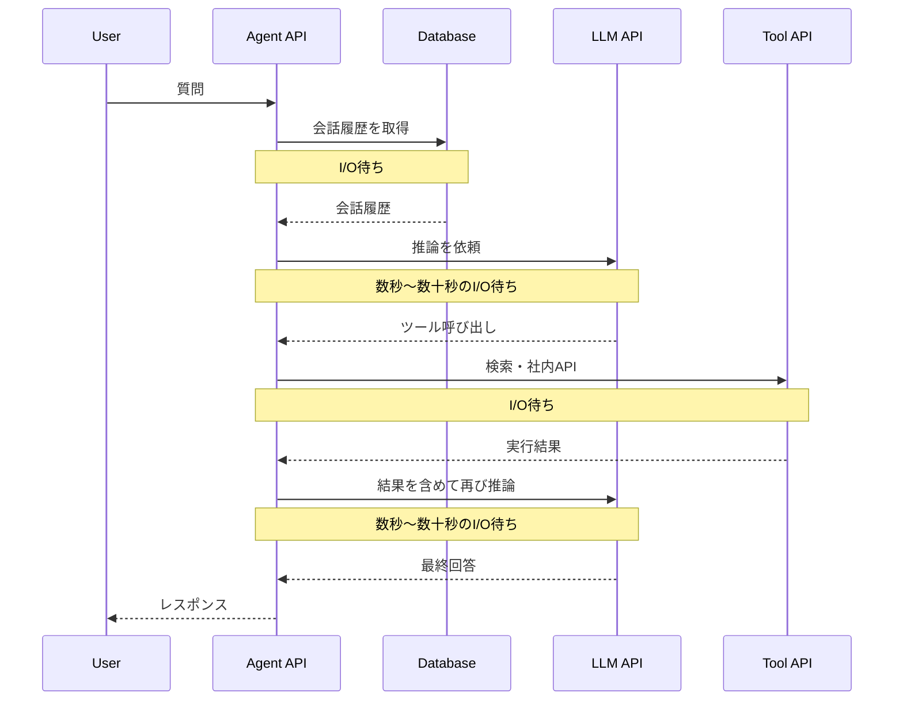
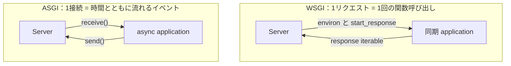
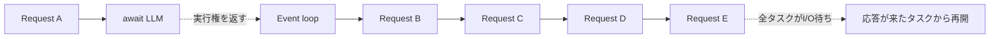
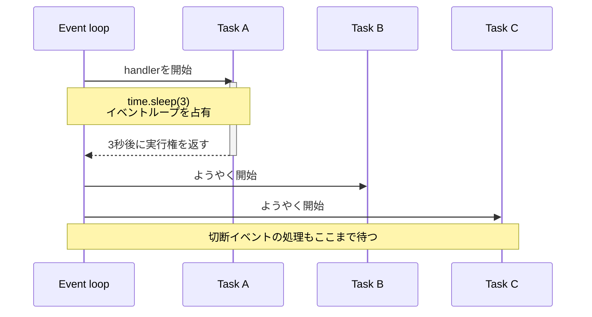
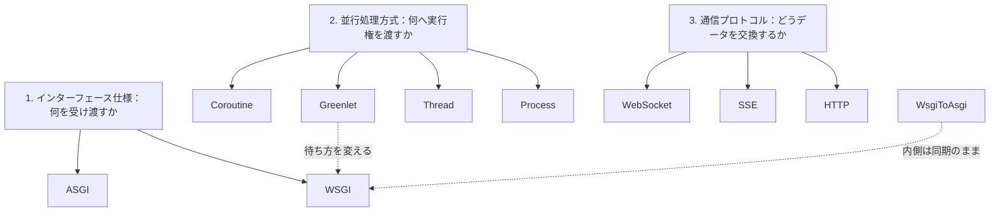
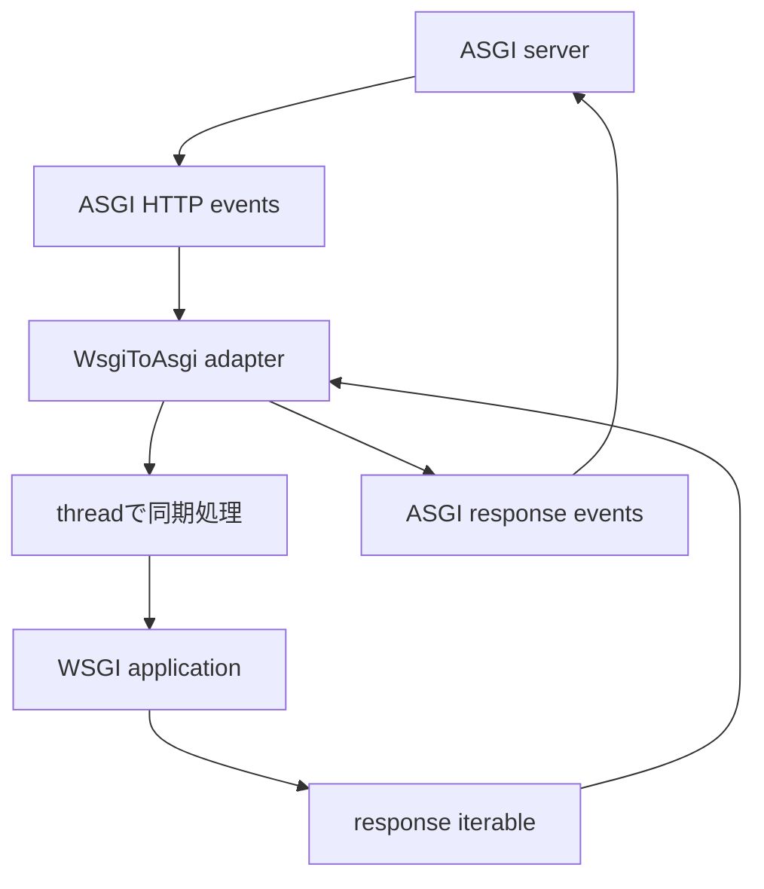

<strong>大規模言語モデル（LLM）</strong>を使ったアプリケーションを作ろうとすると、[**FastAPI**](https://fastapi.tiangolo.com/)と[**Uvicorn**](https://www.uvicorn.org/)を使った実装例によく出会います。PythonのAI APIでは[**ASGI（Asynchronous Server Gateway Interface）**](https://asgi.readthedocs.io/en/latest/)ベースの構成が一般的らしい、と私も特に疑問を持たずに使っていました。

しかし、なぜ[**Flask**](https://flask.palletsprojects.com/)と[**Gunicorn**](https://gunicorn.org/)ではなくFastAPIとUvicornなのか、そもそも[**WSGI（Web Server Gateway Interface）**](https://peps.python.org/pep-3333/)とASGIの違いは何か、と聞かれるとうまく説明できませんでした。「ASGIは非同期だから速い」という理解だけでは、WSGIでも[**worker**](https://docs.gunicorn.org/en/stable/design.html)や[**thread**](https://docs.python.org/3/library/threading.html)を増やせることや、ASGIアプリでも処理が止まることを説明できません。

調べてみると、ポイントは単なる速度比較ではなく、外部APIの応答を待っている間に、サーバーがほかのリクエストを進められるかどうかでした。本記事ではLLM APIを呼ぶAIエージェントを例に、WSGIとASGIの違いをリクエストの流れから整理します。

## AIエージェントの処理は「待つ」ことが多い

典型的なAIエージェントの処理を単純化すると、次のようになります。



エージェントは高度な計算をしているように見えますが、アプリケーションサーバー側でLLMを推論しているわけではありません。外部のLLMや検索サービスを利用する構成なら、Pythonプロセスが実際にCPUを使う時間より、ネットワーク越しの応答を待つ時間のほうが長くなりがちです。

ここで問題になるのが、あるリクエストが待っている間に、同じサーバーへ来た別のリクエストをどう扱うかです。

## WSGIとASGIはサーバー製品ではない

まず、よく一緒に登場する名前を分けておきます。

- Flaskや[**Django**](https://www.djangoproject.com/)、FastAPIはWebアプリケーションフレームワーク
- GunicornやUvicornはアプリケーションを動かすアプリケーションサーバー
- WSGIとASGIはサーバーとPythonアプリケーションの間のインターフェース仕様

GunicornとUvicornの違いを理解する前に、両者がアプリケーションとどのように会話するかを見る必要があります。

### WSGIはリクエストを関数呼び出しとして扱う

[WSGIの仕様（PEP 3333）](https://peps.python.org/pep-3333/)では、アプリケーションは概ね次の形を取ります。

```python
def application(environ, start_response):
    method = environ["REQUEST_METHOD"]
    path = environ["PATH_INFO"]
    body = f"{method} {path}".encode()

    start_response(
        "200 OK",
        [
            ("Content-Type", "text/plain"),
            ("Content-Length", str(len(body))),
        ],
    )
    return [body]
```

サーバーはリクエスト情報を`environ`という辞書に入れてアプリケーションを呼びます。ここにはHTTPメソッド、パス、クエリ文字列、ヘッダー、リクエスト本文を読むための`wsgi.input`などが入ります。上の例では`REQUEST_METHOD`と`PATH_INFO`を使って、`GET /example`のようなレスポンス本文を作っています。

`start_response`は、アプリケーションがHTTPステータスとレスポンスヘッダーをサーバーへ渡すための関数です。

このモデルは単純で、短いHTTPリクエストを同期的に処理するアプリケーションでは扱いやすいものです。レスポンスのイテラブルから複数のチャンクを返せるため、HTTPストリーミングも可能です。

一方、インターフェース自体がHTTPのリクエストとレスポンスに結びついています。レスポンスを返している途中で「クライアントから新しいメッセージが届いた」「接続が切れた」といったイベントを、サーバーからアプリケーションへ継続的に渡す共通の経路はありません。

### ASGIは接続上のイベントを送受信する

[ASGIの仕様](https://asgi.readthedocs.io/en/latest/specs/main.html)では、アプリケーションは3つの引数を受け取る非同期関数です。

```python
async def application(scope, receive, send):
    if scope["type"] != "http":
        return

    method = scope["method"]
    path = scope["path"]
    request = await receive()
    request_body = request.get("body", b"")
    body = f"{method} {path}: {len(request_body)} bytes".encode()

    await send({
        "type": "http.response.start",
        "status": 200,
        "headers": [
            (b"content-type", b"text/plain"),
            (b"content-length", str(len(body)).encode()),
        ],
    })
    await send({
        "type": "http.response.body",
        "body": body,
    })
```

- `scope`は接続の種類、HTTPメソッド、パスなど、その接続を通して変わらない情報
- `receive`はサーバーからイベントを受け取る関数
- `send`はサーバーへイベントを送る関数

上の例では`scope`からHTTPメソッドとパスを読み、`receive()`で受け取った`http.request`イベントから本文を取り出しています。実際のリクエスト本文は複数イベントに分かれる場合があるため、本番の実装では`more_body`が`False`になるまで受信を続ける必要があります。

HTTPなら`http.request`や`http.response.body`、[**WebSocket**](https://datatracker.ietf.org/doc/html/rfc6455)なら`websocket.connect`や`websocket.receive`というように、プロトコルごとの出来事をイベントとして表します。[HTTPとWebSocketのASGI仕様](https://asgi.readthedocs.io/en/latest/specs/www.html)では、接続種別ごとのscopeとイベントが標準化されています。

したがって、WSGIとASGIの本質的な違いは「同期か非同期か」だけではありません。WSGIが1回のHTTPリクエストを関数呼び出しとして表すのに対し、ASGIは接続中に起きる通信をイベントの交換として表します。



<div style="text-align: center;"><small>まず比較したいのは処理速度ではなく、サーバーとアプリケーションが何を受け渡せるかです。</small></div>

## 5人が同時にAIエージェントへ質問したら

ここからは、1回の処理でLLM APIの応答を3秒待つエージェントを考えます。5人がほぼ同時に質問した場合、何が起きるでしょうか。

ラボでは次の設定を使います。

```text
Requests: 5
WSGI workers: 2
I/O wait: 3 seconds
ASGI mode: await
```

下の「2 · I/O Wait」を選び、「5件を送信」を押してみてください。次にASGIの待ち方を`await`から`blocking`へ切り替えると、同じASGIでもタスクの進み方が変わります。

ラボの`平均 latency`は、5件が同時に到着してから各リクエストが完了するまでの平均時間です。`throughput`は、シミュレーション上の1秒あたりに完了したリクエスト数を示します。ASGI側は、<strong>1 worker・1 event loop</strong>という設定です。

<iframe
  src="/labs/wsgi-asgi-lab.html"
  title="WSGIとASGIのRequest Lifecycle Lab"
  height="1200"
  loading="lazy"
  scrolling="no"
></iframe>

<div style="text-align: center;"><small><a href="/labs/wsgi-asgi-lab.html" target="_blank" rel="noopener noreferrer">ラボを別画面で開く</a></small></div>


<details>
<summary>ラボを表示できない場合は静止画を見る</summary>


</details>

### WSGIのsync workerは待機中も席を使う

Gunicornのデフォルトであるsync workerは、一度に1リクエストを処理します。2 workerで5リクエストを受け取ると、最初の2件がそれぞれworkerを使い、残りの3件は空きを待ちます。

AとBはほとんどCPUを使っていません。それでも同期関数の呼び出しは終わっていないため、2つのworkerは別のリクエストを始められません。AかBが完了して初めて、Cが空いた席に座れます。

これはWSGI仕様が「1接続につき1プロセスを使え」と定めているからではなく、WSGIアプリケーションをsync workerで実行した結果です。[Gunicornの設計ドキュメント](https://docs.gunicorn.org/en/stable/design.html)でも、sync workerは一度に1リクエストを処理すると説明されています。

### ASGIでは待機中のタスクを脇へ置ける

ASGI側では、LLM APIの呼び出しを次のように待つとします。

```python
async def run_agent():
    response = await async_llm_client.generate(...)
    return response
```

`await`に到達すると、現在のタスクは「LLM APIから返事が来るまで進めない」と[**イベントループ**](https://docs.python.org/3/library/asyncio-eventloop.html)へ伝え、いったん実行権を返します。イベントループは、その間にB、C、D、Eの処理を開始できます。



ここでASGIは、LLM APIの3秒という応答時間を短縮してはいません。複数の待ち時間を重ね、Pythonが何もできない時間を別の接続へ使っているだけです。そのため、改善するのは主に同時に複数のリクエストを受けたときのスループットや待機列であり、単発リクエストの応答時間とは限りません。

## `async def`でも処理は止まる

ラボのASGI modeを`await`から`blocking`へ変えると、先ほどとは違う動きになります。たとえば、非同期関数の中で同期版のLLMクライアントを直接呼んだ場合です。

```python
async def run_agent():
    response = sync_llm_client.generate(...)
    return response
```

この`generate()`が同期的にネットワーク応答を待つ間は、イベントループに実行権が戻りません。そのため、Aだけでなく、同じイベントループ上で待っているB、C、D、Eも進めなくなります。



つまり、関数を`async def`にしたりASGIサーバーで動かしたりするだけでは不十分です。LLM SDK、HTTPクライアント、DBドライバーなど、I/Oを行う処理も[**non-blocking I/O**](https://docs.python.org/3/library/asyncio-dev.html#running-blocking-code)に対応している必要があります。

同期APIしかない場合は、[**asyncio**](https://docs.python.org/3/library/asyncio.html)の[`asyncio.to_thread()`](https://docs.python.org/3/library/asyncio-task.html#asyncio.to_thread)などを使って別スレッドへ処理を移す方法があります。ただし、これは無制限に並行実行できるという意味ではなく、今度はスレッドプールの容量が上限になります。CPU負荷の高い処理もイベントループを占有するため、重い画像処理やローカル推論は別プロセスやジョブworkerへ分ける必要があります。

## では、WSGIではAIアプリを作れないのか

もちろん作れます。ここまでの比較だけを見ると「WSGIは同時処理できない」と感じますが、それはWSGIとsync workerを同一視した理解です。

<!--この図はよくわからないので、テキストで表現してください。-->


<div style="text-align: center;"><small>WSGI/ASGI、worker方式、通信プロトコルは別々の判断軸です。</small></div>

ASGIに移行せずWSGIアプリケーションでI/O待ちの並行性を高める方法はいくつかあります。

| 方法 | 待機中にほかの処理を進める単位 | 既存コードへの影響 | 注意点 |
|---|---|---:|---|
| workerプロセスを増やす | プロセス | 小さい | 待機中のリクエストごとに比較的重いプロセスを使う |
| `gthread`を使う | OSスレッド | 小さい | スレッド数とメモリに上限がある |
| `gevent`を使う | greenlet | 小さい場合がある | ライブラリとの互換性やmonkey patchを確認する |
| `WsgiToAsgi`を使う | アダプター内のスレッド | 小さい | 内側のアプリケーションは同期WSGIのまま |

Gunicornはsync workerのほかに、スレッドを使う`gthread`や[**greenlet**](https://greenlet.readthedocs.io/en/latest/)を使う[**gevent**](https://www.gevent.org/) workerを提供しています。同期のLLM SDKを維持したい場合、thread workerで十分なこともあります。

geventは、対応したI/Oが待ちに入ったときに別のgreenletへ切り替えます。標準ライブラリのsocketなどを協調動作する実装へ置き換えるmonkey patchも利用できます。ただし、[geventの公式ドキュメント](https://docs.gevent.org/api/gevent.monkey.html)が注意しているように、patchのタイミングやライブラリとの互換性を確認する必要があります。

ここで大切なのは、geventが変えるのはWSGIの「待ち方」であって「表現方法」ではないことです。HTTPレスポンスをイテラブルとして返すWSGIのインターフェースは変わらず、ASGIの`receive`や`send`が使えるようになるわけではありません。

[`asgiref.wsgi.WsgiToAsgi`](https://github.com/django/asgiref#wsgi-to-asgi-adapter)のようなアダプターを使えば、既存のWSGIアプリケーションをASGIサーバー上で動かせます。



これは既存アプリケーションと新しいASGIエンドポイントを共存させる移行境界として便利です。ただし、外側をラップしても内側の同期関数が非同期関数へ変わるわけではありません。WSGI関数の中で自然に`await`できるようになったり、WebSocketを処理できるようになったりするわけではない点には注意が必要です。ASGI仕様の[WSGI Compatibility](https://asgi.readthedocs.io/en/latest/specs/www.html#wsgi-compatibility)でも、WSGIアプリケーションはスレッドプールで実行する必要があるとされています。

## それでもAIアプリでASGIをよく見る理由

WSGIにもI/O待ちを効率よく処理する選択肢があります。それでも新しいAIアプリケーションでASGIが自然な選択になりやすいのは、並行性だけが理由ではありません。

- 非同期LLMクライアントやHTTPクライアントをそのまま`await`できる
- 複数のツールAPIを並行して呼びやすい
- レスポンスをチャンクに分けて送信しやすい
- 切断をイベントとして受け取り、不要になった処理をキャンセルしやすい
- WebSocketのような双方向通信へ発展させやすい
- DB接続プールの作成と破棄を[**lifespanイベント**](https://asgi.readthedocs.io/en/latest/specs/lifespan.html)で管理できる

ASGIでは、`http.response.body`を`more_body=True`で複数回`send()`し、その合間に`await`できます。LLMからトークンが届くたびにチャンクを送りつつ、待っている間は同じworkerで別の接続を進められます。WSGIでもレスポンスのイテラブルを使ったHTTPストリーミングは可能ですが、同期イテラブルの次の値を待つ間にworkerを占有しやすく、レスポンス送信中にクライアント側から届くイベントを同じインターフェースで受け取ることもできません。

切断を扱える利点は、すでに画面を閉じたユーザーのためにLLM生成、ツール呼び出し、DB問い合わせを続けずに済むことです。長い処理ほど、計算資源やAPI料金の無駄を減らせます。ASGIでは`http.disconnect`や`websocket.disconnect`を`receive()`で受け取れるため、関連するタスクをキャンセルし、確保したリソースを解放する流れを組み立てやすくなります。

lifespanイベントは、サーバーがリクエストを受け始める前にDB接続プールを一度だけ作り、停止時に確実に閉じるために使えます。各リクエストで接続を作り直すコストを避けられるうえ、起動時の初期化に失敗した場合はリクエスト受付前に失敗を通知できます。また、接続プールとリクエスト処理を同じイベントループに結び付けられるため、別のループに属する接続を誤って共有する問題も避けやすくなります。

ただし、WSGIでも、このうちいくつかは実装できます。たとえばレスポンスのイテラブルを使ったHTTPストリーミングは可能です。

まとめると、AIアプリでASGIが選ばれるのは、LLMやツールの応答を待つ時間が長く、その待ち時間にほかの接続を進めたいからです。さらにストリーミング、切断、キャンセルといった処理も同じモデルで扱いたいと考えると、ASGIとasyncioの組み合わせが素直です。
