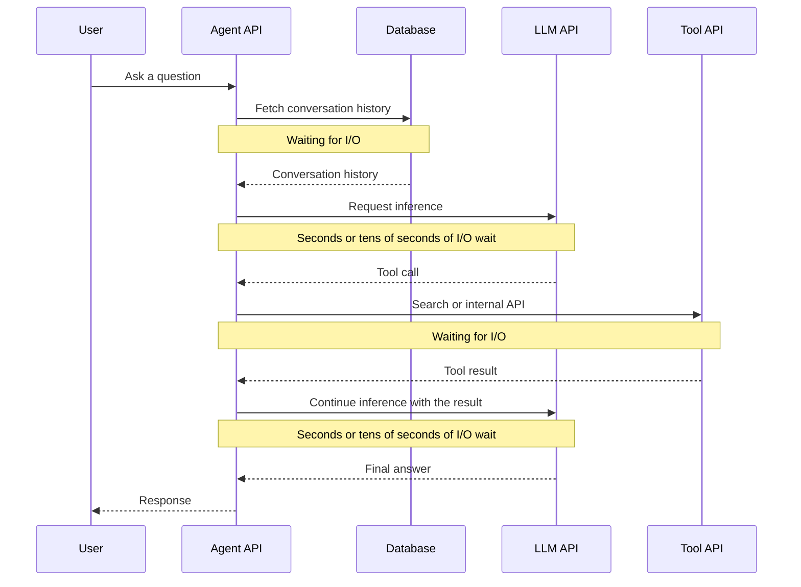
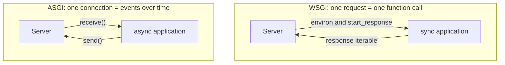
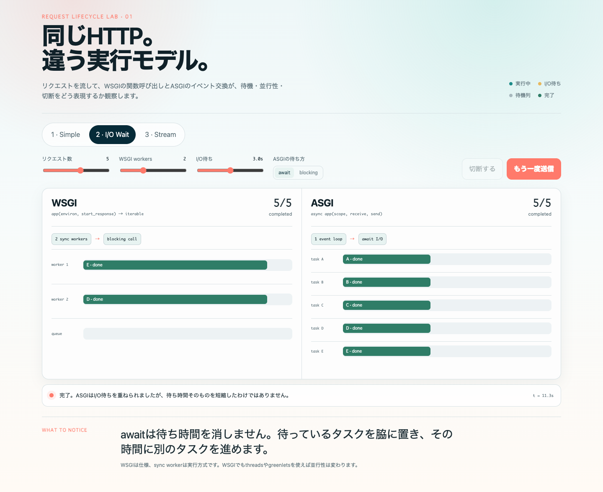
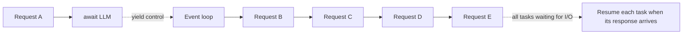
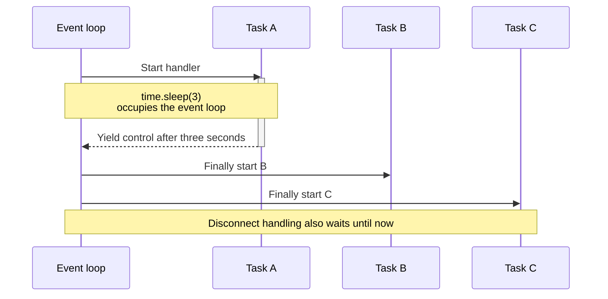
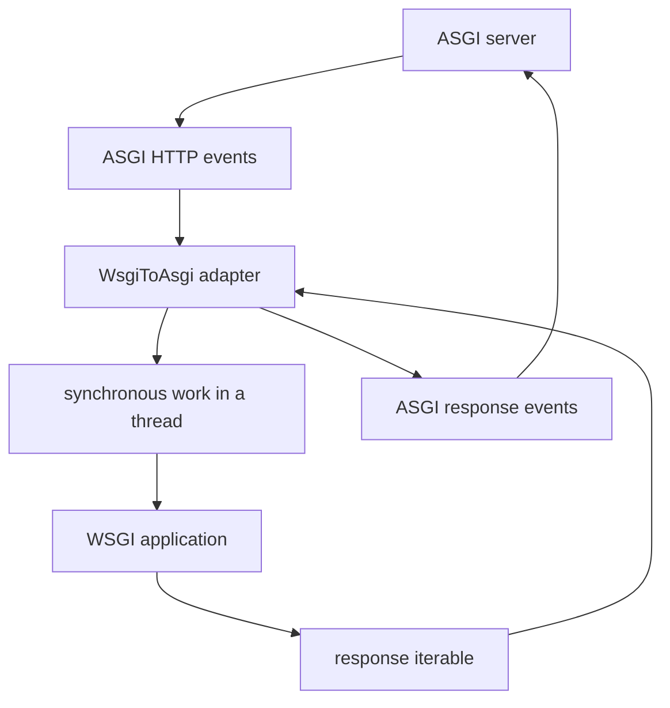

When you build an application with a <strong>large language model (LLM)</strong>, many Python examples use [**FastAPI**](https://fastapi.tiangolo.com/) and [**Uvicorn**](https://www.uvicorn.org/). I also used this setup without asking why. I simply assumed that [**ASGI (Asynchronous Server Gateway Interface)**](https://asgi.readthedocs.io/en/latest/) was the usual choice for AI APIs in Python.

But I could not clearly explain why they used FastAPI and Uvicorn instead of [**Flask**](https://flask.palletsprojects.com/) and [**Gunicorn**](https://gunicorn.org/). I could not even explain the difference between ASGI and [**WSGI (Web Server Gateway Interface)**](https://peps.python.org/pep-3333/). Saying “ASGI is faster because it is asynchronous” does not answer the question. A WSGI server can use more [**workers**](https://docs.gunicorn.org/en/stable/design.html) or [**threads**](https://docs.python.org/3/library/threading.html), and an ASGI application can still block.

The more useful question is this: can the server work on other requests while one request waits for an external API? In this article, I will compare WSGI and ASGI by following requests through an AI agent that calls an LLM API.

## AI Agents Spend a Lot of Time Waiting

A simplified AI agent request might look like this:



The agent may appear to be doing complex work, but the application server is not usually running the LLM itself. When the agent uses external LLM and search services, the Python process often spends much more time waiting for network responses than using the CPU.

So what happens when another request reaches the same server while the first one is waiting?

## WSGI and ASGI Are Interface Specifications

First, let us separate several names that often appear together:

- Flask, [**Django**](https://www.djangoproject.com/), and FastAPI are web application frameworks.
- Gunicorn and Uvicorn are application servers that run those applications.
- WSGI and ASGI specify the interface between a server and a Python application.

Before comparing Gunicorn and Uvicorn, we need to see how each server communicates with an application.

### WSGI Represents a Request as a Function Call

In the [WSGI specification (PEP 3333)](https://peps.python.org/pep-3333/), an application looks roughly like this:

```python
def application(environ, start_response):
    method = environ["REQUEST_METHOD"]
    path = environ["PATH_INFO"]
    body = f"{method} {path}".encode()

    start_response(
        "200 OK",
        [
            ("Content-Type", "text/plain"),
            ("Content-Length", str(len(body))),
        ],
    )
    return [body]
```

The server puts the request data into a dictionary called `environ`, then calls the application. The dictionary contains the HTTP method, path, query string, headers, and `wsgi.input`, which the application can use to read the request body. The example uses `REQUEST_METHOD` and `PATH_INFO` to create a response body such as `GET /example`.

The application uses `start_response` to pass the HTTP status and response headers back to the server.

This model is simple and works well for applications that handle short HTTP requests synchronously. The response iterable can also yield multiple chunks, so WSGI supports HTTP streaming.

However, the interface is built around one HTTP request and response. While the response is in progress, WSGI has no standard way to keep sending events such as “the client sent another message” or “the connection was closed” to the application.

### ASGI Exchanges Events over a Connection

In the [ASGI specification](https://asgi.readthedocs.io/en/latest/specs/main.html), an application is an asynchronous function with three arguments:

```python
async def application(scope, receive, send):
    if scope["type"] != "http":
        return

    method = scope["method"]
    path = scope["path"]
    request = await receive()
    request_body = request.get("body", b"")
    body = f"{method} {path}: {len(request_body)} bytes".encode()

    await send({
        "type": "http.response.start",
        "status": 200,
        "headers": [
            (b"content-type", b"text/plain"),
            (b"content-length", str(len(body)).encode()),
        ],
    })
    await send({
        "type": "http.response.body",
        "body": body,
    })
```

- `scope` contains information that does not change during the connection, such as its type, the HTTP method, and the path.
- `receive` is a function for receiving events from the server.
- `send` is a function for sending events to the server.

The example reads the HTTP method and path from `scope`, then extracts the body from an `http.request` event returned by `receive()`. In a real request, the body may be split across multiple events, so production code must keep receiving until `more_body` becomes `False`.

ASGI uses different events for different protocols. HTTP uses events such as `http.request` and `http.response.body`. A [**WebSocket**](https://datatracker.ietf.org/doc/html/rfc6455) uses events such as `websocket.connect` and `websocket.receive`. The [ASGI HTTP and WebSocket specification](https://asgi.readthedocs.io/en/latest/specs/www.html) defines the scopes and events for each connection type.

So the main difference is not only synchronous versus asynchronous code. WSGI represents one HTTP request as a function call. ASGI represents the communication during a connection as a series of events.



<div style="text-align: center;"><small>Compare what the server and application can exchange.</small></div>

## What Happens When Five People Ask at Once?

Consider an agent that waits three seconds for an LLM API during each request. What happens if five people send questions at nearly the same time?

The lab below starts with these settings:

- Requests: 5
- WSGI workers: 2
- I/O wait: 3 seconds
- ASGI mode: await

Select “2 · I/O Wait” and click “Send 5 requests.” Then switch the ASGI mode from `await` to `blocking`. Even though both versions use ASGI, their tasks progress very differently.

In the lab, `average latency` is the average time from the arrival of the five requests to the completion of each request. `Throughput` is the number of requests completed per simulated second. The ASGI side uses <strong>one worker and one event loop</strong>.

<iframe
  src="/labs/wsgi-asgi-lab.html"
  title="WSGI and ASGI Request Lifecycle Lab"
  height="1200"
  loading="lazy"
  scrolling="no"
></iframe>

<div style="text-align: center;"><small><a href="/labs/wsgi-asgi-lab.html" target="_blank" rel="noopener noreferrer">Open the lab in a new tab</a></small></div>

<details>
<summary>If the lab does not load, view a static screenshot</summary>



</details>

### A WSGI Sync Worker Remains Occupied While Waiting

Gunicorn's default sync worker processes one request at a time. With two workers and five requests, the first two requests occupy the workers while the other three wait for a free worker.

Requests A and B use almost no CPU while they wait. But their synchronous function calls have not returned, so the workers cannot start another request. Request C can start only after A or B finishes.

WSGI itself does not say “use one process per connection.” This behavior comes from running a WSGI application with sync workers. [Gunicorn's design documentation](https://docs.gunicorn.org/en/stable/design.html) also explains that a sync worker handles one request at a time.

### ASGI Can Set Aside a Waiting Task

On the ASGI side, suppose the LLM call looks like this:

```python
async def run_agent():
    response = await async_llm_client.generate(...)
    return response
```

When the code reaches `await`, the current task tells the [**event loop**](https://docs.python.org/3/library/asyncio-eventloop.html) that it must wait for the LLM API. The task then gives control back to the event loop. While it waits, the event loop can start B, C, D, and E.



ASGI has not reduced the LLM API's three-second response time. It has simply overlapped several waits. When Python has nothing to do for one connection, it can work on another. This mainly improves throughput and reduces queues when many requests arrive together. It does not necessarily reduce the latency of one request.

## `async def` Can Still Block

Switch the lab's ASGI mode from `await` to `blocking`, and the behavior changes. One way to create this problem is to call a synchronous LLM client directly from an asynchronous function:

```python
async def run_agent():
    response = sync_llm_client.generate(...)
    return response
```

While `generate()` waits synchronously for the network response, it does not give control back to the event loop. As a result, B, C, D, and E cannot run either.



Using `async def` or an ASGI server is not enough. The code that performs I/O—including LLM SDKs, HTTP clients, and database drivers—must also support [**non-blocking I/O**](https://docs.python.org/3/library/asyncio-dev.html#running-blocking-code).

If only a synchronous API is available, you can move the call to another thread with [`asyncio.to_thread()`](https://docs.python.org/3/library/asyncio-task.html#asyncio.to_thread) from [**asyncio**](https://docs.python.org/3/library/asyncio.html). But this does not allow unlimited concurrency: the thread pool has a fixed size. CPU-heavy work can also block the event loop, so heavy image processing or local inference should usually run in another process or a job worker.

## Does This Mean WSGI Cannot Run an AI App?

Of course it can. The comparison so far may make WSGI sound unable to handle requests concurrently. But that view mixes up WSGI itself with one type of worker: the sync worker.

It helps to separate the problem into three decisions:

1. **Interface specification:** What can the server and application exchange? This is where WSGI and ASGI differ.
2. **Concurrency model:** What can run while one operation waits? Web servers in general use processes, threads, greenlets, or coroutines. WSGI deployments commonly use the first three. Native coroutine-based concurrency across requests primarily belongs to ASGI.
3. **Communication protocol:** How does the client exchange data with the server? Examples include HTTP, Server-Sent Events (SSE), and WebSocket.

For example, a gevent worker lets a WSGI application use greenlets. But the server and application still communicate through WSGI. Similarly, `WsgiToAsgi` translates between ASGI and WSGI at the boundary. It does not make the WSGI application asynchronous.

There are several ways to increase I/O concurrency in a WSGI application without migrating it to ASGI:

| Approach                                   | What runs while another request waits | Impact on existing code | Caveat                                                                    |
| ------------------------------------------ | ------------------------------------- | ----------------------: | ------------------------------------------------------------------------- |
| Add worker processes                       | Process                               |                     Low | Each waiting request occupies a relatively heavy process                  |
| Use `gthread`                              | OS thread                             |                     Low | Thread count and memory are finite                                        |
| Use `gevent`                               | Greenlet                              |           Sometimes low | Check library compatibility and monkey patching                           |
| Run an async view through a WSGI framework | Coroutine within the current request  |                  Medium | Can overlap I/O within that request, but the WSGI worker remains occupied |
| Use `WsgiToAsgi`                           | Thread inside the adapter             |                     Low | The application inside remains synchronous WSGI                           |

In addition to sync workers, Gunicorn provides the thread-based `gthread` worker and a [**gevent**](https://www.gevent.org/) worker based on [**greenlets**](https://greenlet.readthedocs.io/en/latest/). If you need to keep a synchronous LLM SDK, a thread worker may be sufficient.

gevent switches to another greenlet when a compatible I/O operation starts waiting. It can also use monkey patching to replace standard-library modules such as `socket` with versions that work with gevent. However, the [official gevent documentation](https://docs.gevent.org/api/gevent.monkey.html) warns that you need to check when patches are applied and whether your libraries are compatible. The important point is that gevent changes how a WSGI application waits, not how it represents communication. The WSGI interface still returns an HTTP response as an iterable; it does not gain ASGI's `receive` and `send` functions.

An adapter such as [`asgiref.wsgi.WsgiToAsgi`](https://github.com/django/asgiref#wsgi-to-asgi-adapter) can run an existing WSGI application behind an ASGI server.



This is useful during a gradual migration, when an existing WSGI application needs to run beside new ASGI endpoints. However, wrapping the application does not turn its synchronous functions into asynchronous ones. A WSGI function still cannot naturally use `await` or handle WebSockets. The ASGI specification's section on [WSGI compatibility](https://asgi.readthedocs.io/en/latest/specs/www.html#wsgi-compatibility) also says that WSGI applications must run in a thread pool.

## Why ASGI Is Still Common in AI Applications

WSGI offers several ways to handle I/O waits efficiently. Even so, ASGI is often a good choice for a new AI application because concurrency is only part of the story:

- You can directly `await` asynchronous LLM and HTTP clients.
- You can call several tool APIs concurrently.
- You can send a response in chunks.
- You can receive a disconnect event and cancel work that is no longer needed.
- You can extend the application to bidirectional protocols such as WebSocket.
- You can manage the creation and cleanup of a database connection pool with [**lifespan events**](https://asgi.readthedocs.io/en/latest/specs/lifespan.html).

With ASGI, an application can call `send()` several times with `http.response.body` and `more_body=True`, using `await` between calls. It can send each chunk as tokens arrive from the LLM. While it waits for more tokens, the same worker can handle other connections. WSGI can also stream HTTP through a response iterable.[^flask-sse] But the worker is often busy while it waits for the next value, and the application cannot receive client events through the same interface while it sends the response.

Disconnect handling matters because there is little value in continuing LLM generation, tool calls, and database queries after the user closes the page. For a long operation, cancellation can save both computing resources and API costs. With ASGI, the application can receive `http.disconnect` or `websocket.disconnect` through `receive()`, cancel related tasks, and release their resources.

Lifespan events let a server create a database connection pool once before it accepts requests, then close the pool during shutdown. This avoids creating new connections for every request. It also lets the server report an initialization error before it starts accepting traffic. Finally, it helps keep the pool and request handlers on the same event loop, instead of accidentally sharing connections across loops.

In short, AI applications spend a lot of time waiting for LLMs and tools. ASGI lets the server use that time to handle other connections. It also provides one model for streaming, disconnection, and cancellation. That is why ASGI and asyncio are a common combination in new AI applications.

[^flask-sse]: Check [this previous article](https://hippocampus-garden.com/flask_sse/) for example.
